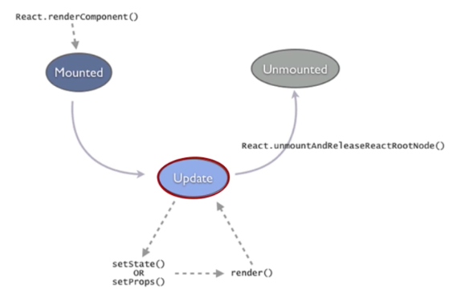
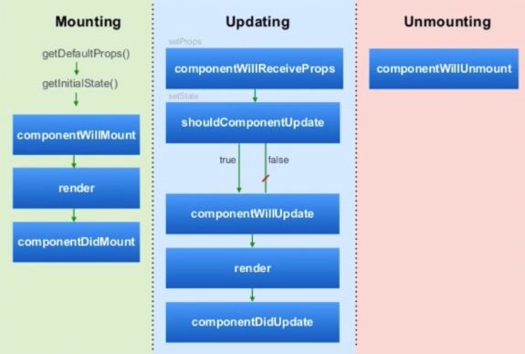

# 入门

## 目录  
- 最简单的 jsx 语法文件  
    - 语法规则
    - ES5 与 ES6 书写方式
- React Components 生命周期 
    - Lifecycle图解1
    - Lifecycle图解2
    - 代码示例
- React-event-listener  
- 非DOM属性介绍  

## 1、最简单的 [JSX](https://reactjs.org/docs/jsx-in-depth.html) 语法
``` JSX
var Hello = React.createClass({
    render: function() {
        styleObj = {
            color: ‘red’,
            fontSize: ‘44px’,
        };
    }
    return <div className=“inner-text" style={ styleObj }>Hello {this.prop.name}</div>
})

React.render(<Hello name=“World”/>, document.getElementById(‘container'));

// 自定义了一个 Hello 标签插入到了 ID 为container 的容器中
// jsx 语法中的类名 class 必须写成 className
// jsx 语法中的行内样式不能写成字符串，而是双括号中的对象形式 style={{color: ‘red'}}
// jsx 语法中的样式名采用 驼峰 写法
```

### 1.1、JSX语法规范
- JSX 里面约定分别使用首字母大小写来区分本地组件和 HTMl 标签，并采用驼峰命名
- 要使用 JS 表达式作为属性值，只需把这个表达式用一对大括号包起来 {} ，不要用 ""
- htmlFor 和 className
- CSS in JS（React Style）
- JSX 里添加注释很容易；他们只是JS表达式而已。只需要在一个标签的子节点内（非最外层）用 {} 包围需要注释的部分,like {/* some thing */}
### 1.2、JSX语法下的 ES5 与ES6 书写方式
```jsx
// ES5
var HelloReact = React.createClass({
    render: function() {
        return <h1>{this.props.name}</h1>
    }
});

// ES6
“use strict”
class HelloReact extends React.Component{
    render() {
        <h1>Hello React</h1>
    }
}

// 共同
ReactDOM.render(
    <div>
        <HelloReact name=“John"/>
    </div>
);
```

## 2、React Components 生命周期
### 2.1、Lifecycle图解1

- _其中每一个状态，React 都对其封装了对应的 hook 函数_
- Mounted 阶段：React Components被render解析生成Dom节点并插入浏览器的 DOM 结构的一个过程
- Update 阶段：一个 mounted React Components 被重新 render 的过程，并不是说相应的 DOM 结构一定变化，他会对比 state 是否改变从而选择是否改变 DOM 结构
- Unmounted： 一个 mounted 的React Components 对应的 DOM 节点被从 DOM 结构中移除的过程

### 2.2、Lifecycle 图解2

>* componentWillMount: 将要 mounting 触发  
>* componentDidMount:  mounting 之后 触发  
>* getInitialState: 用来初始化 React Components 的 state  

>* componentWillReceiveProps: 当一个 mounted components 将要接受新的 prop 时被调用，接收参数：新的 props 对象。可以在函数体内执行比较传入参数跟 this.props 异同，从而执行一些诸如改变组件state的操作  
>* shouldComponentUpdate: 在一个mounted 的 component 已经接受到新的 props 跟 state 之后  
>* componentWillUpdate: 将要更新的时候触发  
>* componentDidUpdate: 更新完成之后触发  
>* componentWillUnmount: 将要销毁的时候，可以在其内部执行释放内存啊图片啊等等资源的操作，但得益于垃圾回收机制，这个方法很少用

### 2.3 代码示例
代码例子，判断是否有必要跟新 DOM 结构，两个参数：新的 props 对象、新的 state 对象
``` jsx
var Hello = React.createClass({
    getInitialState: function() {
        alert(‘init’);
        return {
            opacity: 0.9,
            fontSize: ‘12px'
        }
    },
    render: function() {
        return <div className=“inner-text" style={{ opacity: this.state.opacity, fontSize: this.state.fontSize }}>Hello {this.prop.name}</div>
    },
    componentWillMount: function() {
        alert(‘will');
    },
    componentDidMount: function() {
        alert(‘did');

        window.setTimeout(function() {
            this.setState({
                opacity: 0.5,
                fontSize: ‘44px'
            });
        }.bind(this), 1000);
    }
});

React.render(<Hello name=“World”/>, document.getElementById(‘container'));
```
- 结果：弹出 init -> will -> did -> 一秒后文字变化样式  
- 其中主要理解 state 的意义  
- 构建 React components 的时候要区分 props 跟 state 的作用，- props 一般不会变。**往往是通过调用组件方在调用的时候指定的，一般情况下是不会变的，尤其是对于被调用组件来说，props 的拥有者是其调用方，或者说结构上是其 parent。**而 state 我们认为是私属于当前组件的。

## 三、React-event-listener
### 代码示例(简单的‘双向绑定’实现)
``` jsx
const ClickComponent = React.createClass({displayName: "ClickComponent",
	handleClick: function(ev) {
	    const tipE = ReactDOM.findDOMNode(this.refs.tip);
		if(tipE.style.display === 'none') {
			tipE.style.display = 'inline';
		} else {
			tipE.style.display = 'none';
		}

		ev.stopPropagation();
		ev.preventDefault();
	},
	render: function() {
		return (
			React.createElement("div", null, 
				React.createElement("button", {onClick: this.handleClick}, "显示|隐藏"), React.createElement("span", {ref: "tip"}, "This is the test words")
			)
		);
	}
});

const InputComponent = React.createClass({displayName: "InputComponent",
	changeHandler: function(ev) {
		this.setState({
			inputContent: ev.target.value
		});

		ev.stopPropagation();
		ev.preventDefault();
	},
	getInitialState: function() {
		return {
			inputContent: ""
		}
	},
	render: function() {
		return (
			React.createElement("div", null, 
				React.createElement("input", {type: "text", onChange: this.changeHandler}), React.createElement("span", null, this.state.inputContent)
			)
		)
	}
});

ReactDOM.render(
	React.createElement("div", null, 
		React.createElement(ClickComponent, null), 
		React.createElement("br", null), React.createElement("br", null), 
		React.createElement(InputComponent, null)
	),
	document.getElementById('root')
);
```
- 注意理解其中 **ref** 属性在 jsx 语法中特殊的作用
