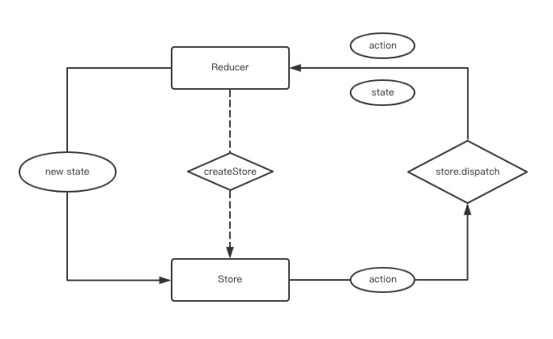
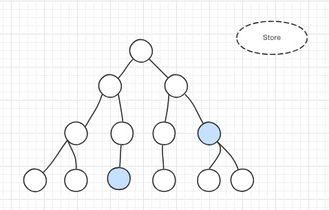

# 从redux原理谈前端状态管理

## 什么是 redux
- Redux 是 `JavaScript` 状态容器，提供可预测化的状态管理。
- Redux 除了和 React 一起用外，还支持其它界面库。 它体小精悍（只有2kB，包括依赖）。

## 推荐阅读
- Medium
    - [you might not need redux](https://medium.com/@dan_abramov/you-might-not-need-redux-be46360cf367)
    - [github](https://github.com/philholden/redux-swarmlog) example
- 备用

## redux 核心运作流程

## 为什么要用redux

### 8个原因
- 将状态保持到本地存储，然后从开箱即用启动。
- 在服务器上预填充状态，以HTML格式将其发送到客户端，并从中启动，开箱即用。
- 序列化用户操作并将它们与状态快照一起附加到自动错误报告中，以便产品开发人员可以重放它们以重现错误。
- 通过网络传递操作对象以实现协作环境，而不会对代码的编写方式进行重大更改。
- 维护撤消历史记录或实施乐观突变，而不会对代码的编写方式进行重大更改。
- 在状态发展之间旅行，并在代码改变时从行动历史中重新评估当前状态，即TDD。
- 为开发工具提供全面的检查和控制功能，以便产品开发人员可以为他们的应用程序构建自定义工具。
- 在重用大多数业务逻辑的同时提供备用UI。

### 自己的感受
- 优点
    - 可以更好的实现前端的分离 ---- 【数据】与【业务】分离
    - 减少重复代码
    - 减少api请求
- 不足
    - 分离使得代码“跳跃性”很强，建立合理store模型需要不断体会
    - 项目写作上“代码熟悉”成本变高
    - 简单应用不建议使用

### component tree

