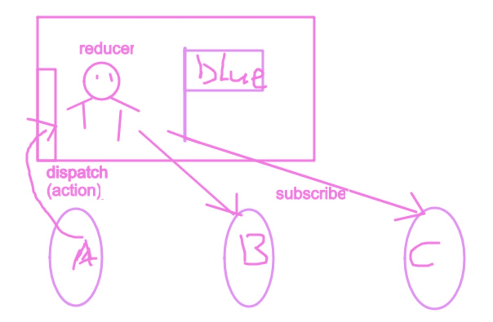

# 从redux原理谈前端状态管理

## 什么是 redux
- Redux 是 `JavaScript` 状态容器，提供可预测化的状态管理。
- Redux 除了和 React 一起用外，还支持其它界面库。 它体小精悍（只有2kB，包括依赖）。

 ## redux的诞生，flux架构
 [flux](http://pixelhunter.me/post/110248593059/flux-solutions-compared-by-example)  
 [Flux 架构入门教程 阮一峰](http://www.ruanyifeng.com/blog/2016/01/flux.html)  

 > Flux是为了解决在前端模块化开发后，组件之间的频繁数据交互导致的项目维护复杂的问题。Flux是一种架构思想，专门解决软件之间的结构问题，好比MVC架构思想，但是Flux思想要更为易懂。

 - 为什么出现
    - 一般的组件传值，会在组件之间造成强关联，项目复杂后，组件传值会使整个项目变得异常复杂
- flux架构基本思想概况
    - Flux架构下，前端业务被拆分成了View，Actions，Store三部分
    - 在View中的交互操作将会触发到actions，actions中对store进行改变
    - 当store进行改变后，相应的反过来去更新视图，这就是单向数据流
- redux出现
    - 出现于社区
    - Redux是flux的一种实现，Redux不单单可以用在react上面。
    - 用于react的redux的package名称叫做react-redux。
    - 基于flux的架构思想，redux分为action、reducer和state三部分
- action、reducer、state
    - action用于定义函数，定义更新的数据
    - reducer用来实际的操作数据，对传来的数据进行操作(纯函数)
    - state即为reducer return的部分，state可以设置默认值

## 拟物化理解redux基本原理


## 代码实现

旗子放在外面，大家随便改
```js
let state = {
    title: {
        text: 'new title text',
        bg: 'lightblue'
    },
    content: {
        text: 'content',
        bg: 'gold'
    }
}

function render(state) {
    renderTitle(state);
    renderContent(state);
}
function renderTitle(state) {
    const title = window.title;
    title.innerHTML = state.title.text;
}
function renderContent(state) {
    const content = window.content;
    content.style.backgroundColor = state.content.bg;
}

render(state);
```

不能直接修改state,而是通过dispatch派发动作，且动作是固定有限的
```js
function dispatch(action) {
    switch (action.type) {
        case UPDATE_TITLE_TEXT:
            state.title.text = action.text;
            return;
        case UPDATE_CONTENT_BG:
            state.content.bg = action.bg;
            return;
        default:
            return;
    }
}
```

建立一个房子，将保安与旗子保护起来
```js
function createStore() {
    let state = {
        title: {
        text: 'new title text',
        bg: 'lightblue'
        },
        content: {
            text: 'content',
            bg: 'gold'
        }
    }
    function getState() {
        return JSON.parse(JSON.stringify(state));
    }
    function dispatch(action) {
        switch (action.type) {
            case UPDATE_TITLE_TEXT:
                state.title.text = action.text;
                return;
            case UPDATE_CONTENT_BG:
                state.content.bg = action.bg;
                return;
            default:
                return;
        }
    }
    return {
        getState,
        dispatch
    }
}

let store = createStore();
render(store.getState());
store.dispatch({......});
render(store.getState());
```

抽取公用代码，分离私有代码
```js
// createStore是公用代码，不掺杂业务逻辑，业务逻辑在reducer中
function createStore(reducer) {
    let state;
    function getState() {
        return JSON.parse(JSON.stringify(state));
    }
    function dispatch(action) {
        state = reducer(state, action);
    }
    // 在创建仓库的时候调用dispatch，制定一个不存在的type，返回默认state
    dispatch({ type: '@INIT' });
    return {
        getState,
        dispatch
    }
}

let initState = {
    title: {
        text: 'new title text',
        bg: 'lightblue'
    },
    content: {
        text: 'content',
        bg: 'gold'
    }
}
// 接收老状态，action，返回新状态
function reducer(state = initState, action) {
    switch (action.type) {
        case UPDATE_TITLE_TEXT:
            return { ...state, title: { ...state.title, text: action.text } }
        case UPDATE_CONTENT_BG:
            return { ...state, content: { ...state.content, bg: action.bg } }
        default:
            return;
    }
}
let store = createStore(reducer);
render(store.getState());
```

实现订阅与取消订阅dispatch，让想要监听state变化的组件实时变化
```js
function createStore(reducer) {
    let state;
    let listeners = [];
    function getState() {
        return JSON.parse(JSON.stringify(state));
    }
    function dispatch(action) {
        state = reducer(state, action);
        listeners.forEach(l => l());
    }
    // 传入要监听的函数
    functoin subscribe(listener) {
        listeners.push(listener);
        return function() {
            listeners = listeners.filter(item => item !== listener);
        }
    }
    // 在创建仓库的时候调用dispatch，制定一个不存在的type，返回默认state
    dispatch({ type: '@INIT' });
    return {
        getState,
        dispatch,
        subscribe
    }
}
```


## redux 核心运作流程


## 为什么要用redux

### 8个原因
- 将状态保持到本地存储，然后从开箱即用启动。
- 在服务器上预填充状态，以HTML格式将其发送到客户端，并从中启动，开箱即用。
- 序列化用户操作并将它们与状态快照一起附加到自动错误报告中，以便产品开发人员可以重放它们以重现错误。
- 通过网络传递操作对象以实现协作环境，而不会对代码的编写方式进行重大更改。???
- 维护撤消历史记录或实施乐观突变，而不会对代码的编写方式进行重大更改。
- 在状态发展之间旅行，并在代码改变时从行动历史中重新评估当前状态，即TDD。
- 为开发工具提供全面的检查和控制功能，以便产品开发人员可以为他们的应用程序构建自定义工具。???
- 在重用大多数业务逻辑的同时提供备用UI。

### 自己的感受
- 优点
    - 可以更好的实现前端的分离 ---- 【数据】与【业务】分离
    - 减少重复代码
    - 减少api请求
- 不足
    - 分离使得代码“跳跃性”很强，建立合理store模型需要不断体会
    - 简单应用不建议使用

### component tree


## 与vuex的比较

### vuex的操作流向：
view——>commit——>mutations——>state变化——>view变化（同步操作）
view——>dispatch——>actions——>mutations——>state变化——>view变化（异步操作）

### redux的操作流向
view——>actions——>reducer——>state变化——>view变化（同步操作）

- 异步操作需要结合另外的工具
    - [redux-thunk](https://github.com/reduxjs/redux-thunk)
    - [redux-saga](https://github.com/redux-saga/redux-saga/)

### 不错的一篇文章
[Vuex与Redux(dva)](https://blog.csdn.net/hyupeng1006/article/details/80755667)

## 扩展
- [react-redux](https://github.com/reduxjs/react-redux) star 14.7k
- 新一代react状态管理工具 [mobx](https://github.com/mobxjs/mobx)，star 17.6k
- react、redux为基础的前端快速开发框架，重新封装了react-redux(by蚂蚁金服) [dva](https://github.com/dvajs/dva) star 11.7k
- 可插拔的企业级 react 应用框架，文件即路由(by蚂蚁金服) [umi](https://github.com/umijs/umi) star 2.9k
- 解决父组件更新子组件不跟新的无敌好用库 [immutable.js](https://facebook.github.io/immutable-js/)

## 推荐阅读
- Medium
    - [you might not need redux](https://medium.com/@dan_abramov/you-might-not-need-redux-be46360cf367)
    - [github](https://github.com/philholden/redux-swarmlog) example
- 掘金
    - [在react中使用redux](https://juejin.im/post/5b471a5de51d4519873f2c07)
- 备用

