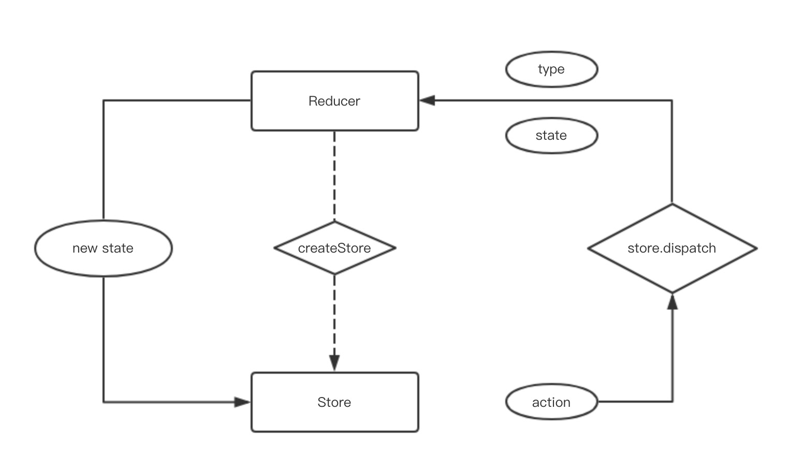

# 从redux原理谈前端状态管理

## 什么是 redux
- Redux 是 `JavaScript` 状态容器，提供可预测化的状态管理。
- Redux 除了和 React 一起用外，还支持其它界面库。 它体小精悍（只有2kB，包括依赖）。

 ### redux的诞生，flux架构
 [flux](http://pixelhunter.me/post/110248593059/flux-solutions-compared-by-example)
 [Flux 架构入门教程 阮一峰](http://www.ruanyifeng.com/blog/2016/01/flux.html)
 > Flux是为了解决在前端模块化开发后，组件之间的频繁数据交互导致的项目维护复杂的问题。

 - 为什么出现
    - 一般的组件传值，会在组件之间造成强关联，项目复杂后，组件传值会使整个项目变得异常复杂
- 什么是flux架构
    - Flux架构下，前端业务被拆分成了View，Actions，Store三部分
    - 在View中的交互操作将会触发到actions，actions中对store进行改变
    - 当store进行改变后，相应的反过来去更新视图，这就是单向数据流
- redux出现
    - 出现于社区
    - Redux是flux的一种实现，Redux不单单可以用在react上面。
    - 用于react的redux的package名称叫做react-redux。
    - 基于flux的架构思想，redux分为action、reducer和state三部分
- action、reducer、state
    - action用于定义函数，定义更新的数据
    - reducer用来实际的操作数据，对传来的数据进行操作(纯函数)
    - state即为reducer return的部分，state可以设置默认值

## 推荐阅读
- Medium
    - [you might not need redux](https://medium.com/@dan_abramov/you-might-not-need-redux-be46360cf367)
    - [github](https://github.com/philholden/redux-swarmlog) example
- 备用

## redux 核心运作流程

## 为什么要用redux

### 8个原因
- 将状态保持到本地存储，然后从开箱即用启动。
- 在服务器上预填充状态，以HTML格式将其发送到客户端，并从中启动，开箱即用。
- 序列化用户操作并将它们与状态快照一起附加到自动错误报告中，以便产品开发人员可以重放它们以重现错误。
- 通过网络传递操作对象以实现协作环境，而不会对代码的编写方式进行重大更改。
- 维护撤消历史记录或实施乐观突变，而不会对代码的编写方式进行重大更改。
- 在状态发展之间旅行，并在代码改变时从行动历史中重新评估当前状态，即TDD。
- 为开发工具提供全面的检查和控制功能，以便产品开发人员可以为他们的应用程序构建自定义工具。
- 在重用大多数业务逻辑的同时提供备用UI。

### 自己的感受
- 优点
    - 可以更好的实现前端的分离 ---- 【数据】与【业务】分离
    - 减少重复代码
    - 减少api请求
- 不足
    - 分离使得代码“跳跃性”很强，建立合理store模型需要不断体会
    - 简单应用不建议使用

### component tree

## 与vuex的比较

### vuex的操作流向：
view——>commit——>mutations——>state变化——>view变化（同步操作）
view——>dispatch——>actions——>mutations——>state变化——>view变化（异步操作）

### redux的操作流向
view——>actions——>reducer——>state变化——>view变化（同步操作）

- 异步操作需要结合另外的工具
    - [redux-thunk](https://github.com/reduxjs/redux-thunk)
    - [redux-saga](https://github.com/redux-saga/redux-saga/)

### 不错的一篇文章
[Vuex与Redux(dva)](https://blog.csdn.net/hyupeng1006/article/details/80755667)

## 扩展
- [react-redux](https://github.com/reduxjs/react-redux) star 14.7k
- 新一代react状态管理工具 [mobx](https://github.com/mobxjs/mobx)，star 17.6k
- react、redux为基础的前端快速开发框架，重新封装了react-redux(by蚂蚁金服) [dva](https://github.com/dvajs/dva) star 11.7k
- 可插拔的企业级 react 应用框架，文件即路由(by蚂蚁金服) [umi](https://github.com/umijs/umi) star 2.9k

