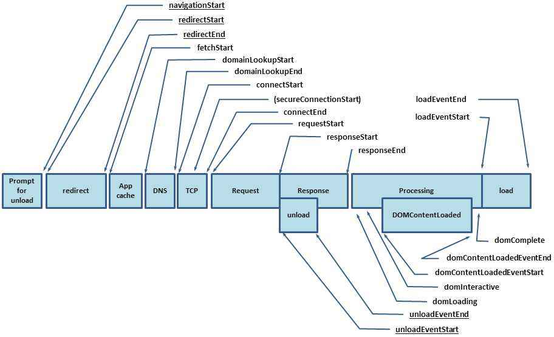

# 前端监控

## 应用领域
- 性能监控
- 数据监控
- 异常监控

## 浏览器的Performance api

如上图，从浏览器地址栏输入一个地址会一次发生下面的事情
- redirect 重定向或 unload 卸载
- app cache
- dns
- tcp 三次握手四次挥手
- request 包括 requestStart跟requestEnd
- response 包括 responseStart跟responseEnd
- Processing Dom开始加载与解析 domLoading（dom开始加载）、domLoading（dom元素加载完）、domInteractive（dom解析完成）与 domContentLoaded 两者时间一样、domCompelete（整个界面资源资源加载完成，也就是window.onLoad）、loadEventStart 与 loadEventEnd 是 window.onLoad 这个区间内逻辑执行的时间
  - `domContentLoaded` 与 `domCompelete` 的区别: 前者是 dom 加载完成，后者是 dom 中的资源加载完成

## 资源加载时间监控
- 使用 `new PerformanceObserver` 来单条监控
- 在 `window.onload`时间之后使用 `performance.getEntriesByType('resource');` 来监控

## xhr监控
- 面向切面的编程思想
- 自己重写 `xhr` prototype 的 `open` 与 `send` 事件，在其中捕获请求的时间与请求的其他信息

## 错误监控
- 使用 window.onerror 时间拿到参数 error

## 信息上报
- 可以使用ajax请求来上报
- 更常用的方式是 `new Image().src = 'http://p.gif?a=1&b=2'`
