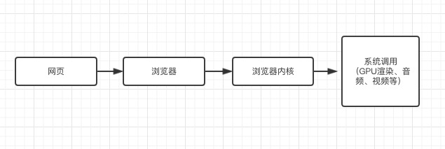
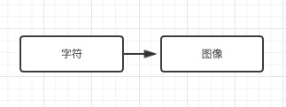
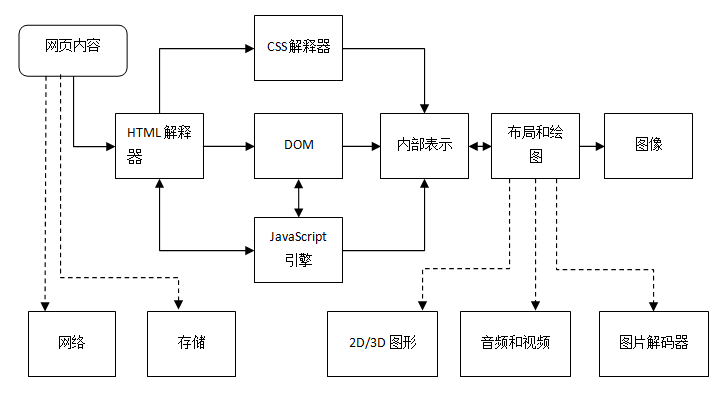
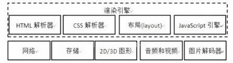

# 浏览器渲染原理

## 预热问题
- 操作系统中的应用是怎么运行的
- 浏览器究竟是什么，是底层还是应用
- webkit和浏览器的关系
- 浏览器是怎么呈现网页的
- 经典问题，输入网址到浏览器页面呈现完毕，发生了什么

## 浏览器历史
1. 1991年，第一台浏览器`worldwideweb`万维网的出现，后改名为`Nexus`，功能简单
1. 1993年， `Mosaic` 出现，可以显示图片，使用 `useragent`区分客户端，决定是否发送图片，节省带宽
1. 1994年，`Mozzila` 浏览器
1. 1995年，IE为抢占市场，退出IE浏览器，`useragent`为 `Mozilla/1.22` (其实就是伪造)
1. 1998年，`Netscape`失利，成立`Mozilla`组织
1. 2003年，网景公司解散，`Mozilla`基金会成立，推进了后来的`Firefox`
1. `Mozilla` 开发了 `Geoko` 变成 `FireFox`，useragent 为 `Mozilla/5.0`
1. 众多浏览器厂商出现，useragent上都带有 `Mozilla/5.0`
1. chrome 与 Safari 出现，占有了大批的市场份额

## 用户代理`UserAgent`
- 查看
    - navigator.useragent
- 作用
    - 判断浏览器的类型采用兼容方案
    - 判断是否为移动端
    - 标识H5容器，方便调用H5容器特定接口，例如`微信开发`，`客户端hibird`
- 注意
    - useragent伪装成本很低，不要过分依赖

## 内核的概念

### 系统层面
对于操作系统而言，内核是操作系统的核心。**是第一层基于硬件的软件扩种**。提供最核心最基础的服务。`应用程序通过内核进行系统调用，进而操作计算机的硬件，内核是可以直接管理硬件的`。内核代码简洁高效，基本上没有什么bug。由于是最底层的服务，一点基本的错误也会造成整个系统的崩溃，好处也是可见的。基于一个稳定的内核，开发者可以构建不同场景的操作系统和应用软件。例如，给予linux的centos与ubuntu

### 浏览器层面
对于浏览器来说，同样存在浏览器的内核，与操作系统的内核相似，浏览器内核提供API给开发者使用，同时提供最核心的功能渲染网页、调用操作系统所提供的服务。


最后
对于浏览器厂商来说：高效实用浏览器内核是核心问题
对于开发者来说：理解浏览器内核机制，有利于开发高效的应用

## 浏览器内核

### 定义
浏览器中`负责将表示页面的字符转变成可视图像`的模块



### 内核解析字符
使用node的`tcp`模块向IP发起请求，来观察服务器最初给到的字符究竟是什么
```js
const net = require('net');
const fs = require('fs');
const path = require('path');

const destPort = 80;
const destHost = '120.24.156.16';

let allBuffer = null;

const client = net.createConnection(destPort, destHost, function() {
    console.log('connect to server');
    client.write('GET / HTTP/1.0\r\nAccept: text/html\r\nHost: zakwu.me\r\nCache-Control: no-cache/r/nUser-Agent: Mozilla/5.0 (Macintosh; Intel Mac OS X 10_12_3) AppleWebKit/537.36 (KHTML, like Gecko) Chrome/72.0.3626.121 Safari/537.36\r\n\r\n');
});

client.on('data', function(data) {
    console.log('recieve data');
    if (!allBuffer) {
        allBuffer = data;
    } else {
        allBuffer = Buffer.concat([allBuffer, data]);
    }
});

client.on('error', function(err) {
    console.log(err);
});

client.on('end', function() {
    console.log('connect end');
    if (allBuffer === null) return console.log('no data recieved~~~');
    const htmlContent = allBuffer.toString();
    const ws = fs.createWriteStream(path.join(__dirname, 'output.html'));
    ws.write(htmlContent);
});
```

代码分析
- 所有的网络开发模式下，都是基于socket的一个管道来做的，可以抽象成链接本地到远端的管道
- client.write方法即想远端写入的方法

### 响应组成
```bash
# 起始行
HTTP/1.1 200 OK
# 服务器
Server: nginx/1.1.19
# 服务器发送内容的时间
Date: Thu, 21 Mar 2019 05:45:24 GMT
# 实体类型
Content-Type: text/html; charset=utf-8
# 实体类型
Content-Length: 78659
# 链接状态
Connection: close
# express头
X-Powered-By: Express
# 缓存，public表示任何时候都缓存，max-age表示缓存时间
Cache-Control: public, max-age=0
# 缓存令牌
ETag: W/"7bjxThJ+0QyGqytHIZCLhg=="
# 决定了对于未来的一个请求头，应该用一个缓存的回复(response)还是向源服务器请求一个新的回复（这个不太熟，没用过）
Vary: Accept-Encoding

<!doctype html>
<html>
    <head>
    ...
    </head>
    <body>
    ...
    </body>
</html>
```

思考几个问题：
- 以上这段代码的逻辑
- 返回的字符串如何解析
- 想让返回的字符串呈现为图像，怎么做

### 浏览器渲染要做的工作


上图表示了渲染引擎一般的渲染过程，虚线表示依赖了外部模块（不属于渲染引擎）

重要组件：
- HTML解释器：解释`HTML`文本的解释器，HTML => DOM
- CSS解释器：遇到级联样式时，调用`级联样式表解释器`，为DOM对象计算出样式信息
- JavaScript引擎：遇到`JS`代码时候，需要使用JavaScript解释器，使得JS代码有调用DOM接口和CSSOM接口的能力
- 布局：结合CSS，计算出每个DOM对象的大小与位置信息
- 绘图：经过布局计算DOM节点绘制图像

综上可以知道，`渲染引擎其`实就是四块：


### 进一步介绍渲染
在构建 CSSOM 树时，会阻塞渲染，直至 CSSOM 树构建完成。并且构建 CSSOM 树是一个十分消耗性能的过程，所以应该尽量保证`层级扁平`，减少过度层叠，越是具体的 CSS 选择器，执行速度越慢。
当 HTML 解析到 script 标签时，会暂停构建 DOM，完成后才会从暂停的地方重新开始。也就是说，如果你想首屏渲染的越快，就越不应该在首屏就加载 JS 文件。并且 CSS 也会影响 JS 的执行，只有当解析完样式表才会执行 JS，所以也可以认为这种情况下，CSS 也会暂停构建 DOM。这也是最基本的优化，要求将JS写在<body>底部。但是结合日常的开发经验，我们发现，其实即使将<script>标签写在了<header>头中，也不会明显感觉渲染变慢，这是因为现代浏览器会又一次预读取。


