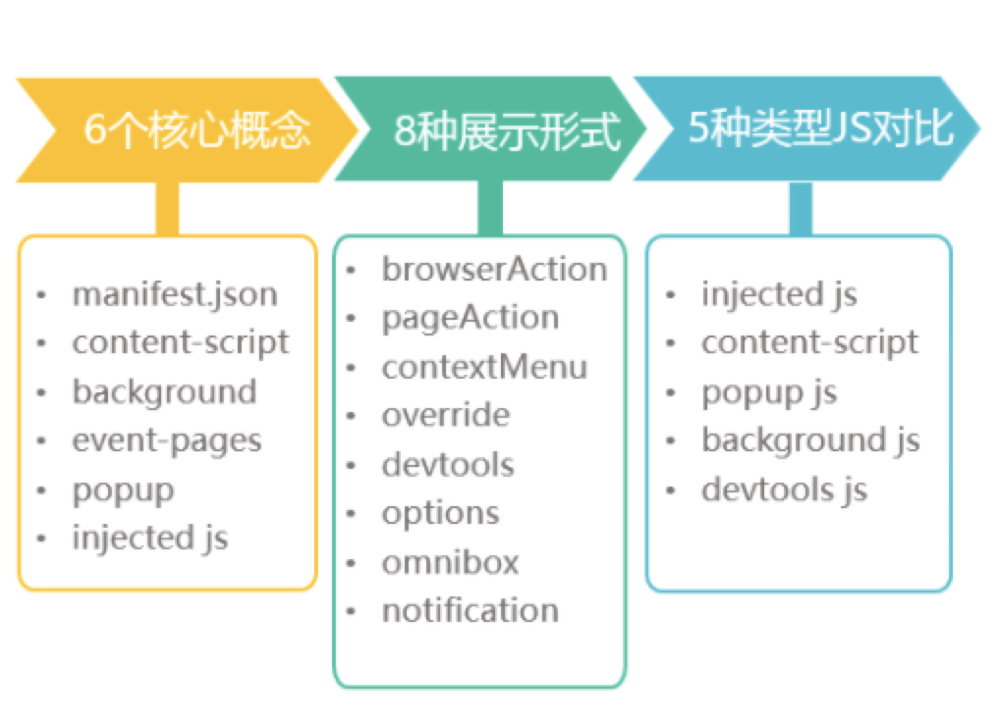

## chrome插件（扩展）
> 严格来讲我们所讲的东西叫做“chrome扩展” chrome extension，真正意义上的chrome插件是对浏览器更底层的内核级别开发。

# chrome插件推荐
- [crxMouse Chrome](https://chrome.google.com/webstore/detail/crxmouse-chrome-gestures/jlgkpaicikihijadgifklkbpdajbkhjo) 一款浏览器鼠标手势扩展
- [快捷扩展管理](https://chrome.google.com/webstore/detail/one-click-extensions-mana/pbgjpgbpljobkekbhnnmlikbbfhbhmem) 一款管理浏览器扩展的扩展
- [捕捉网页截图](https://chrome.google.com/webstore/detail/take-webpage-screenshots/mcbpblocgmgfnpjjppndjkmgjaogfceg?utm_source=chrome-ntp-icon) 一款支持整页滚动截屏的截图扩展
- [油猴脚本 Tampermonkey](https://chrome.google.com/webstore/detail/tampermonkey/dhdgffkkebhmkfjojejmpbldmpobfkfo?utm_source=chrome-ntp-icon) 脚本的天堂。。。
- [Octotree](https://chrome.google.com/webstore/detail/octotree/bkhaagjahfmjljalopjnoealnfndnagc?utm_source=chrome-ntp-icon) github树状菜单项目查看工具
- [Infinity新标签页](https://chrome.google.com/webstore/detail/infinity-new-tab-pro/nnnkddnnlpamobajfibfdgfnbcnkgngh?utm_source=chrome-ntp-icon) new tab工具
- [Proxy SwitchyOmega](https://chrome.google.com/webstore/detail/proxy-switchyomega/padekgcemlokbadohgkifijomclgjgif?utm_source=chrome-ntp-icon) 简单易用的代理切换工作
- [发现更多扩展](https://www.extfans.com/) 一个优质的扩展推荐网站，可以在这里发现好用的chrome扩展，给力的油猴脚本

## 在chrome浏览器中，插件的“地位”
> - 了解进程与线程的概念
> - 浏览器中当网页运行的时候，那些进程在工作，那些线程又在工作？
> - chrome插件运行的时候，是在进程级别还是线程级别？


知道了chrome扩展在浏览器中的定位，自己会有一个认知界定，就是知道chrome扩展可以做什么不可以做什么。

## 学习chrome插件开发有什么意义？
- 灵活的增强我们使用浏览器的体验
    - 书签控制
    - 下载控制
    - 窗口控制
    - 标签控制
    - 网络请求控制
    - 各类事件监听
    - 自定义原生菜单
    - 完善的通信机制
- 自定义做一些特定网站内容的修改与block
- 特定的业务需求，后面讲到开发我们讲

## chrome扩展的开发与调试

### 自由的目录要求
- chrome扩展项目的目录结构，只要保证跟目录有一个 `manifest.json`即可，不需要专门的IDE。
- 查看入口在 `菜单-更多工具-扩展程序`
- 勾选开发者模式即可以使用文件夹的形式查看插件，否则只能使用 `.crx` 后缀的文件。

### 核心介绍
下面将根据此目录来介绍 `chrome扩展的开发`



### 6个核心概念
-----------
1. manifest.json
这是一个Chrome插件最重要也是必不可少的文件，用来配置所有和插件相关的配置，必须放在根目录。其中，manifest_version、name、version3个是必不可少的，description和icons是推荐的。

下面给出的是一些常见的配置项，均有中文注释，完整的配置文档请看[官方开发文档](https://developer.chrome.com/extensions/manifest)。

```json
{
	// 清单文件的版本，这个必须写，而且必须是2
	"manifest_version": 2,
	// 插件的名称
	"name": "demo",
	// 插件的版本
	"version": "1.0.0",
	// 插件描述
	"description": "简单的Chrome扩展demo",
	// 图标，一般偷懒全部用一个尺寸的也没问题
	"icons":
	{
		"16": "img/icon.png",
		"48": "img/icon.png",
		"128": "img/icon.png"
	},
	// 会一直常驻的后台JS或后台页面
	"background":
	{
		// 2种指定方式，如果指定JS，那么会自动生成一个背景页
		"page": "background.html"
		//"scripts": ["js/background.js"]
	},
	// 浏览器右上角图标设置，browser_action、page_action、app必须三选一
	"browser_action": 
	{
		"default_icon": "img/icon.png",
		// 图标悬停时的标题，可选
		"default_title": "这是一个示例Chrome插件",
		"default_popup": "popup.html"
	},
	// 当某些特定页面打开才显示的图标
	/*"page_action":
	{
		"default_icon": "img/icon.png",
		"default_title": "我是pageAction",
		"default_popup": "popup.html"
	},*/
	// 需要直接注入页面的JS
	"content_scripts": 
	[
		{
			//"matches": ["http://*/*", "https://*/*"],
			// "<all_urls>" 表示匹配所有地址
			"matches": ["<all_urls>"],
			// 多个JS按顺序注入
			"js": ["js/jquery-1.8.3.js", "js/content-script.js"],
			// JS的注入可以随便一点，但是CSS的注意就要千万小心了，因为一不小心就可能影响全局样式
			"css": ["css/custom.css"],
			// 代码注入的时间，可选值： "document_start", "document_end", or "document_idle"，最后一个表示页面空闲时，默认document_idle
			"run_at": "document_start"
		},
		// 这里仅仅是为了演示content-script可以配置多个规则
		{
			"matches": ["*://*/*.png", "*://*/*.jpg", "*://*/*.gif", "*://*/*.bmp"],
			"js": ["js/show-image-content-size.js"]
		}
	],
	// 权限申请
	"permissions":
	[
		"contextMenus", // 右键菜单
		"tabs", // 标签
		"notifications", // 通知
		"webRequest", // web请求
		"webRequestBlocking",
		"storage", // 插件本地存储
		"http://*/*", // 可以通过executeScript或者insertCSS访问的网站
		"https://*/*" // 可以通过executeScript或者insertCSS访问的网站
	],
	// 普通页面能够直接访问的插件资源列表，如果不设置是无法直接访问的
	"web_accessible_resources": ["js/inject.js"],
	// 插件主页，很多插件会有主页，在这里做一个广告位
	"homepage_url": "https://www.baidu.com",
	// 覆盖浏览器默认页面
	"chrome_url_overrides":
	{
		// 覆盖浏览器默认的新标签页
		"newtab": "newtab.html"
	},
	// Chrome40以前的插件配置页写法
	"options_page": "options.html",
	// Chrome40以后的插件配置页写法，如果2个都写，新版Chrome只认后面这一个
	"options_ui":
	{
		"page": "options.html",
		// 添加一些默认的样式，推荐使用
		"chrome_style": true
	},
	// 向地址栏注册一个关键字以提供搜索建议，只能设置一个关键字
	"omnibox": { "keyword" : "go" },
	// 默认语言
	"default_locale": "zh_CN",
	// devtools页面入口，注意只能指向一个HTML文件，不能是JS文件
	"devtools_page": "devtools.html"
}
```

-----------
2. content-script
> - 所谓content-scripts，其实就是Chrome插件中向页面注入脚本的一种形式（虽然名为script，其实还可以包括css的），借助content-scripts我们可以实现通过配置的方式轻松向指定页面注入JS和CSS（如果需要动态注入，可以参考下文），最常见的比如：广告屏蔽、页面CSS定制，等等。
> - content-scripts和原始页面共享DOM，但是不共享JS，如要访问页面JS（例如某个JS变量），只能通过injected js来实现。
> - content-scripts不能访问绝大部分chrome.xxx.api，但是不要悲伤，访问扩展api本质也不必要在此处访问。如果非要做，可以借助`background`（后面讲）来调用，再通信。

manifest.json 中对应的配置
```json
{
	// 需要直接注入页面的JS
	"content_scripts": 
	[
		{
			//"matches": ["http://*/*", "https://*/*"],
			// "<all_urls>" 表示匹配所有地址
			"matches": ["<all_urls>"],
			// 多个JS按顺序注入
			"js": ["js/jquery-1.8.3.js", "js/content-script.js"],
			// JS的注入可以随便一点，但是CSS的注意就要千万小心了，因为一不小心就可能影响全局样式
			"css": ["css/custom.css"],
			// 代码注入的时间，可选值： "document_start", "document_end", or "document_idle"，最后一个表示页面空闲时，默认document_idle
			"run_at": "document_start"
		}
	],
}
```

---------------
3. background
> - 后台，是一个常驻的页面，我们永远看不到它。它的生命周期是插件中所有类型页面中最长的，它随着浏览器的打开而打开，随着浏览器的关闭而关闭，所以通常把需要一直运行的、启动就运行的、全局的代码放在background里面。
> - background的权限非常高，几乎可以调用所有的Chrome扩展API（除了devtools），而且它可以无限制跨域，也就是可以跨域访问任何网站而无需要求对方设置CORS !!!
>   - 跨域根本原因：`chrome-extension://id/xx.html`

配置中，background可以通过page指定一张网页，也可以通过scripts直接指定一个JS，Chrome会自动为这个JS生成一个默认的网页

```json
{
	// 会一直常驻的后台JS或后台页面
	"background":
	{
		// 2种指定方式，如果指定JS，那么会自动生成一个背景页
		"page": "background.html"
		//"scripts": ["js/background.js"]
	},
}
```

------------
4. event-page
> - 鉴于 `background` 声明周期过长，长时间挂在“可能”会影响性能，Google 又推出了 `event-page`，在配置文件上，它与 `background` 唯一的区别就是多了一个 `persistent` 参数，表示是否持久的
> - 挺少用的，它关闭的意思就是 `需要的时候开启，不需要的时候关闭`

```json
{
	"background":
	{
		"scripts": ["event-page.js"],
		"persistent": false
	},
}
```

5. popup
> popup是点击browser_action或者page_action图标时打开的一个小窗口网页

```json
{
	"browser_action":
	{
		"default_icon": "img/icon.png",
		// 图标悬停时的标题，可选
		"default_title": "这是一个示例Chrome插件",
		"default_popup": "popup.html"
	}
}
```

6. inject-script
> - 官方没有这种称呼，是在开发者中间普遍称呼的，因为 `content-script` 不能够访问页面中的js，`content-script` 中的代码可以访问DOM，但是DOM缺不能调用它。也就是说，onclick、addEventListener 都不行。
> - 但是我们常能够看到，插件给压面添加了一个按钮（比如百度云破解限速的），通过点击按钮调用扩展的api

可以通过注入script脚本的方式来实现
```js
// 向页面注入JS
function injectCustomJs(jsPath)
{
	jsPath = jsPath || 'js/inject.js';
	var temp = document.createElement('script');
	temp.setAttribute('type', 'text/javascript');
	// 获得的地址类似：chrome-extension://ihcokhadfjfchaeagdoclpnjdiokfakg/js/inject.js
	temp.src = chrome.extension.getURL(jsPath);
	temp.onload = function()
	{
		// 放在页面不好看，执行完后移除掉
		this.parentNode.removeChild(this);
	};
	document.head.appendChild(temp);
}
```

当然还需要配置 `页面能够访问扩展JS`

```js
{
	// 普通页面能够直接访问的插件资源列表，如果不设置是无法直接访问的
	"web_accessible_resources": ["js/inject.js"],
}
```

### 8中展现形式
1. browserAction(浏览器右上角)
2. pageAction(地址栏右侧)
3. 右键菜单
4. override(覆盖3个指定页面)
    1. chrome://history 历史记录页面
    2. chrome://newtab 新标签
    3. chrome://bookmarks 浏览器书签页
5. devtools(开发者工具)
6. 桌面通知
7. option 选项页
8. omnibox

### 5中类型JS对比
