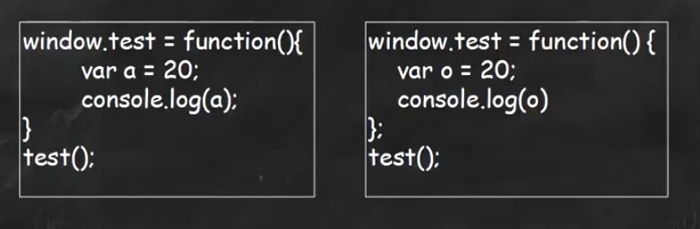
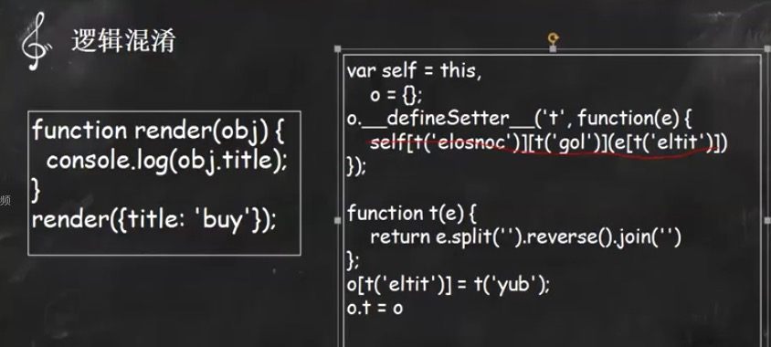

## 加密与安全
- XSS
- CSRF
- web shell 劫持js并插入不安全js

- 前端加密与混淆
- 高性能计算法则
- ASMJS生产环境
- WebAssembly(2017挺火的web二进制)

## 加密与混淆
### 什么是混淆
js源代码本身在浏览器是可见的，但不是每一个开发者都希望自己的代码被其他用户直接阅读。比如恶意软件的制作者们往往对他们的软件进行混淆，分析人员需要进行反混淆才能解除危害。  
具体处理为重命名局部变量、在相同语义的情况下压缩代码，比如去掉分号，常量替换，移除代码空白

> 具体混淆推荐的JS库，UglifyJS
- 作用
    - parser，用于实现抽象语法树(AST)
    - the code generator, 通过AST生成JS代码和sourse map
    - compressor，用于JS代码的压缩
    - mangler，用于减少局部变量命名，用单字母替换
    - scope analyzer，用来判断变量定义范围和变量引用范围的工具
    - tree walker，AST树遍历工具
    - tree transformer，AST树转换工具
- 使用
    - 合并 uglifyjs a.js b.js -o min.js
    - 压缩 uglifyjs a.js -c
    - source map uglifyjs a.js b.js -o min.js --source-map
    - 混淆 uglifyjs a.js -m

基本混淆：

这里只是执行了一个变量替换的混淆，即使只有一个字母

逻辑混淆

这里逻辑混淆就是把已有代码的逻辑换了一种形式实现

aaencode、jjencode的代码混淆，把代码变成各种符号的编码

### 加密与安全 
> JS相比于其他编译成二进制的应用，前端这种纯文本应用，太容易破解和篡改，加密的目的是处于对商业利益的保护，由于座屏太容易被复制篡改，容易失去渠道先机（署名被替换或者移除、链接地址被替换、文案被修改、广告被移除、替换或者植入）需注意加密后的文件不宜太大，没有人工介入不能破解，限制在其他域名部署、不容易被调试跟踪

- 常用加密手段（不可逆）
    - base64，用于传输8Bit字节代码的编码方式之一，可用在HTTP环境下传递较长的表示信息。编码具有不可读性
    - MD5，对一段信息产生信息摘要，以防止被篡改，不可逆，原因是因为它是一种散列函数，使用的hash算法，在计算过程中原文部分信息是丢失了的。
    - sha1，安全哈希算法，主要适用于数字签名标准，里面定义了数字签名算法
- 加密的用途
    - 因为加密与混淆是不同的概念，加密之后的代码是不可逆的，常用在表单上面的一些加密

## 渗透于攻防

