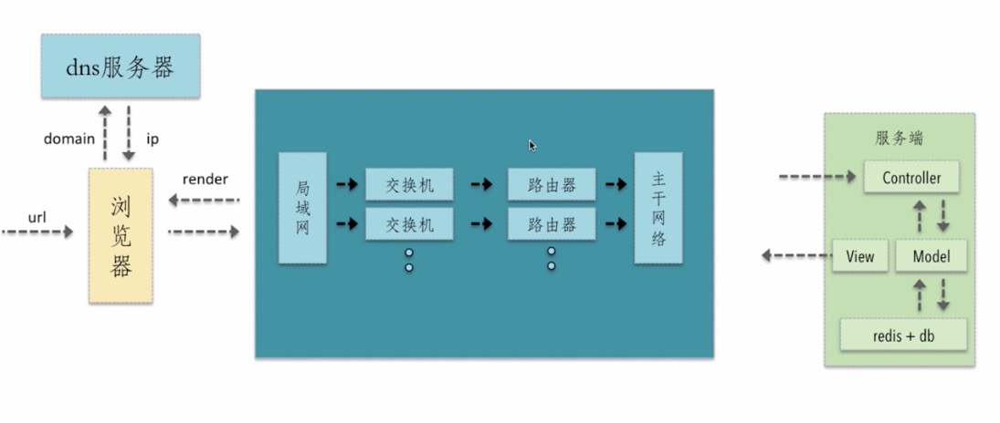

# 前端性能优化

## 请求过程中性能优化的点
下图是传统MVC页面的请求模式

### 优化策略
- dns是否可以通过缓存减少dns查询时间
- 网络请求过程走最近的网络环境
- 相同的静态资源是否可以缓存
- 能够减少HTTP请求大小
- 减少HTTP请求个数，也就是合并HTTP请求
- 服务端渲染支出html，而不是浏览器渲染，优化首屏加载时间

## HTML压缩

### 压缩的效果

### 怎样压缩
- nodejs提供的html-minifier工具（可以选择在构建时或服务端进行压缩）
- 模板引擎渲染压缩

## CSS压缩

## 怎样压缩
- html-minifier 对 html 中的css进行压缩
- clean-css 对 css 进行压缩
- 各种构建工具

## JS压缩

## 合并文件
主要目的：减少请求次数
### 文件合并存在的问题
- 首屏渲染问题：如果首屏渲染依赖的js也被合并到了一个较大的js文件中，那么渲染时间将会受到很大的制约。
- 缓存失效问题：比如之前有三个js文件，且各自带有MD5戳，现在将其全部合并到一个js文件，那个之前任意文件的代码变动将会引起总文件MD5戳的变动，从而是缓存失效。

### 怎么样做
- 公共库合并，因为公共库代码变动少，不会频繁使缓存失效
- 不同页面异步加载不同的js，也就是不同页面js文件分开打包，借助webpack模块化工具