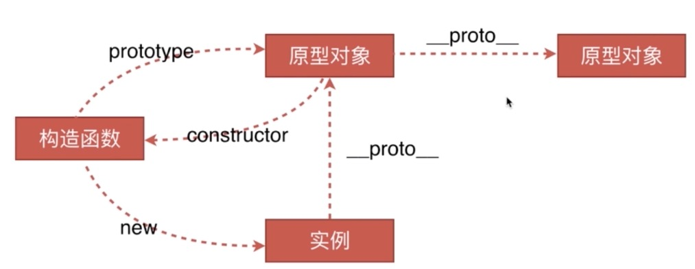
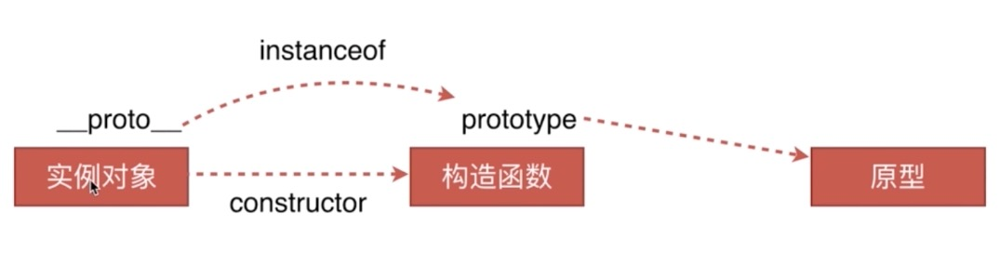

# 原型链类
## 目录
- 创建对象的几种方法
- 原型、构造函数、实例、原型链
- instanceof背后的原理
- new运算符

## 对象的创建以及原型链


```js
var obj1 = {name: 'obj'}; // 字面量的形式
var obj2 = new Object({name: 'obj'}); // new运算符

var M = function(){this.name = 'obj'};
var obj3 = new M();

var p = {name: 'obj'};
var obj4 = Object.create(p); // 创建对象(引用方式)
---------------------------------------------------
- 以上obj1、obj2、obj3都是 “实例”
- 任何被 new 的函数都称为 “构造函数”
- 只有构造函数才会拥有prototype对象，对象是上没有的
- 实例对象拥有属性__proto__指向(引用自)其构造函数的prototype，但是函数也有__proto__那是因为函数其实也是对象

原型链解释：  
obj3.__proto__ === M.prototype // true
M.prototype.__proto__ === Object.prototype // true

```
## 原型链类 instanceof背后原理

instanceof其实判断的是：  
实例下的__proto__与其构造函数的prototype是不是引用自同一个原型
另外：  
如果原型也拥有它自己的构造函数，用instanceof判断实例对象是不是原型构造函数的实例，返回true，也就是说在这条链上构造函数都是这个实例对象的构造函数（这么说虽然不严谨，但是instanceof都会返回true）
```js
// 比如：

obj3 instanceof M // true
obj3 instanceof Object // true

// 用instanceof不能判断一个实例是被那个构造函数构造的，原因上面已经讲清楚，因为instanceof会对原型链上端所有的构造函数返回true。正确的方法是通过constructor判断：
obj3.__proto__.constructor === M // true
obj3.__proto__.constructor === Object // false

```

## new 运算符原理
1. new执行之后，一个新对象被创建。它继承自构造函数foo
1. 构造函数foo被执行。执行的时候，相应的参数会被传入，同时上下文this会被指定为这个新实例。(在不传递任何参数的情况下，new foo等同于 new foo())
1. 如果构造函数反悔了一个“对象”，那么这个对象会取代整个new出来的结果。如果构造函数没有返回对象，那么new出来的结果为步骤1创建的空对象

```js
/**
 * func - 传入的构造函数
 **/ 
var myNew = function(func) {
    var obj = Object.create(func.prototype);// 关联新对象与构造函数的prototype
    var k = func.call(obj);// 执行构造函数并转移转移this
    if (typeof k === 'object') {// 判断构造函数执行完的结果是不是对象类型
        return k;
    } else {
        return obj;
    }
}

------------------------------------------------
// 结合上面创建对象的代码例子
var son = myNew(M);
son instanceof M // true
son instanceof Object // true
son.__proto__.constructore === M // true

M.prototype.say = function() {
    console.log('say something');
}

son.say(); // say something
// 这段代码用 myNew 代替了 new 方法，达到了相同的效果，证实了new工作的原理
```

返回说明一下Object.create()
```js
// 上面创建对象的方法中有一种
var p = {name: 'obj'};
var obj4 = Object.create(p);// Object {}
------------------------------------
这种创建方式使用原型链来连接的，就是说 obj4 的__proto__指向的就是 p,所以obj4本身是咩有name属性的，他只能通过原型链查找name属性

obj4.__proto__ === p // true
```
