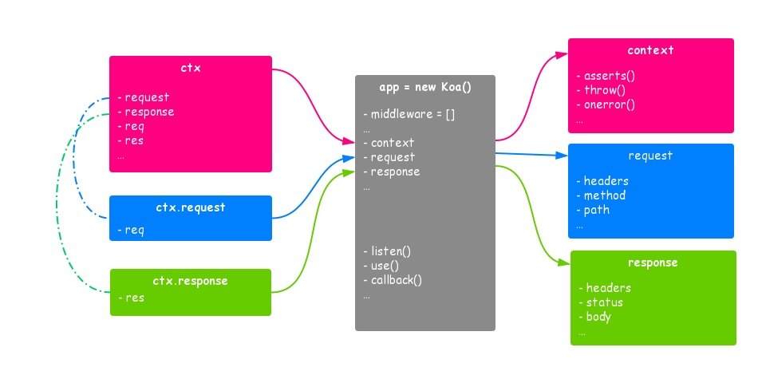

# Koa 源码设计思路

## 核心思想
> - `ctx` 的封装与 `req`，`res` 的代理机制
> -  基于洋葱模型的中间件系统 `middleware`，`app.use()`

## 最简单的 node 服务

```js
const http = require('http');

const server = http.createServer((req, res) => {
  res.statusCode = 200;
  res.setHeader('Content-Type', 'text/plain');
  res.end('Hello World\n');
});
 
server.listen(3000);
```

上面的代码很简单，http 的 createServer 方法创建了一个 http.Server 的实例，http.Sever 继承于 EventEmitter 类。我们传入的函数，其实是添加到了 server 的 request 事件中，相当于一种快捷方式。所以你也完全可以不传入任何参数，然后手动去监听 request 事件。代码的最后将 server 绑定到 3000 端口，开始监听所有来自 3000 端口的请求。

原生的请求中有两个参数，`req` 与 `res`，一个可读流，一个可写流，就是说我们通过 `req` 获得该 `http` 请求的信息，然后将数据写入 `res` 做出响应。

## 最简单的koa服务
```js
const Koa = require('koa');
const app = new Koa();

app.use(async ctx => {
  ctx.type = 'text/plain; charset=utf-8';
  ctx.body = 'Hello World';
});

app.listen(3000);
```

## koa 源码设计整体思路



- Koa是一个类，其上有属性 `middleware`、`context`、`request`、`response`
  - context 每个请求都会创建一个 context 上下文，常用简写 ctx 
  - context.request 上下文上具有 koa 封装的 request 方法，对原生的 req 做了一层封装
  - context.response 上下文上具有 koa 封装的 response 方法，对原生的 res 做了一层封装

- Koa的实例暴露了公用的方法 `use`、`listen`
  - `use` 使用中间件
  - `listen` 使用 `node` 原生 `http` 模块启动http服务

- 每次访问 koa 服务，koa 都会将开发者通过 use 注册的中间件一一执行，且在执行中能够拿到 ctx 上下文
  - 类似于原生 node 服务执行是，函数内部可以拿到原生的 req 与 res

## Koa雏形

```js
const http = require('http');
const context = {};
const request = {};
const response = {};

class Application {
  constructor() {
    this.context = context;
    this.request = request;
    this.response = response;
    this.callbackFn = null;
  }

  use(fn) {
    this.callbackFn = fn;
  }

  callback() {
    return (req, res) => this.callbackFn(req, res)
  }

  listen(...args) {
    const server = http.createServer(this.callback());
    return server.listen(...args);
  }
}

module.exports = Application;
```
## ctx 中的代理
> 一共有两个地方的代理  
> 1、koa 自身 request 与 response 对 原生 req 与 res 的代理  `ctx.request.path`  
> 2、ctx 上下文对于 request 与 response 的代理  `ctx.path`  

- koa 自己的 request 与 response 代理 原生的 req 与 res
  - `request` 是一个对象，`koa/request` 文件中使用属性访问器 `get` 与 `set` 实现代理
  - 例如访问器，我们访问 `request.path` 的时候，其实就是访问 `this.req.path` （这里的`this`指的是`context`）  
- ctx 上的访问代理到 request 与 response
  - 源码中使用了外部的库 `delegate`，其中的原理是 `__defineGetter` 与 `definedSetter`
  - 使用上面的代理方法，其实类似于属性访问器与属性设置器，比如将 `ctx.path` 这个访问指到 访问 `ctx.request.path` (其实又指到了`req.path`)


## 中间件机制---洋葱模型


首先梳理koa服务被创建与访问时候的经过，其核心逻辑在最后两步

- 访问服务
  - 注册中间件 `use(xxx)`
  - 访问服务
  - 进入 http 服务回调函数
  - 创建上下文，创建 context、request、response 并形成代理关系
  - compose 中间件，形成洋葱模型并执行该模型的逻辑

### 洋葱模型实现核心函数 `compose`
> 原理就是使用了 `柯里化` 与 `递归`  
```js
compose(ctx) {
  let dispatch = (index) => {
    let middle = this.middlewares[index];
    return Promise.resolve(middle(ctx, () => dispatch(index + 1)));
  }

  return dispatch(0);
}
```

### 洋葱模型的扩展---redux中的compose

源代码（几年前的js实现）

```js
function compose(...funcs){
  return funcs.reduce((a, b) => (...args) => a( b(...args) ));
}
```

### 一些链接
- [__defineGetter](https://developer.mozilla.org/en-US/docs/Web/JavaScript/Reference/Global_Objects/Object/__defineGetter__)
- [__defineSetter](https://developer.mozilla.org/en-US/docs/Web/JavaScript/Reference/Global_Objects/Object/__defineGetter__)
- [delegate](https://github.com/zenorocha/delegate#readme)
- [lodash函数柯里化](https://www.lodashjs.com/docs/lodash.curry)
- [柯里化函数curry的实现](https://github.com/AlanWenhao/notebook/blob/master/basic/coding-skill/aop/curry.js)
- [koa-compose](https://github.com/koajs/compose#readme)
- [redux compose](https://github.com/reduxjs/redux/blob/4.x/src/compose.js)
- [自己的手写mykoa](https://github.com/AlanWenhao/notebook/tree/master/node/koa)
- [koa，jwt，mysql实现的登录注册、增删改查、图片上传api服务](https://github.com/AlanWenhao/tour-backend)
