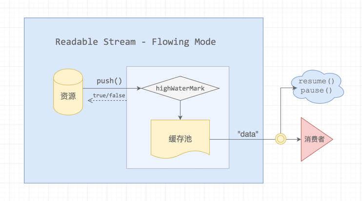
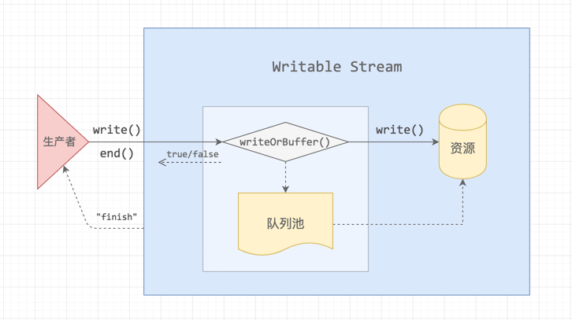

# 七天学不会nodejs——流

> 参考文章:
> - [Node.js Streams: Everything you need to know](https://medium.freecodecamp.org/node-js-streams-everything-you-need-to-know-c9141306be93)
> - [Streams in Node](https://medium.com/@yoshuawuyts/streams-in-node-ab9f13e15d5)
> - [渴望力量吗？少年！流的原理](https://juejin.im/post/5b483255f265da0f521ddf6f)
> - [深入理解 Node Stream 内部机制](https://www.barretlee.com/blog/2017/06/06/dive-to-nodejs-at-stream-module/)
> - [nodejs官方文档](http://nodejs.cn/api/stream.html#stream_stream)


图片来源 [视觉中国](https://www.vcg.com/creative/813084182)  

## “流”的概念
> 流（stream）是一种在 Node.js 中处理流式数据的抽象接口  ——官方文档  

流是数据的集合，你可以将它理解成数据链表或者字符串的形式，区别在于流中的数据并不能立即可用，这里又可以将其理解成水流。你无需将所有的数据一次性全部放入内存，相反，你可以使用流这一特有的性质，完成对大量数据的操作以及逐段处理的操作

在node异步处理数据的基础上，流将要传输的数据处理成小份数据(chunk)连续传输，这样通过更少的内存消耗，从而带来更多的性能提升

---

## “流”的类型
Node.js中有四种基本类型的流：
- `Writable` -- 可读流 可以读取数据的源的抽象。 eg. `fs.createReadStream()`
- `Readable` -- 可写流 可以写入数据目标的抽象。 eg. `fs.createWriteStream()`
- `Duplex` -- 双向流(双工流) 既是可读的，又是可写的。 eg. `not.Socket`
- `Transform` -- 变换流(可变流) 读写过程中可以修改或者转化数据的`双向流`。 eg. `zlib.createDeflate()`

所有的流都是 `EventEmitter` 的实例，他们发出可以被读和写的事件，在这个基础上，我们能够很方便的利用 `pipe` 方法对这些流进行操作
```js
readableSrc.pipe(writableDest)
```
上面这个简单的例子中，我们利用 `readable stream` 的输出作为 `writable stream` 的输入。
那么再来想，如果我们的输入输出都是 `Duplex` 那就可以一直 `pipe` 下去，实现如 Linux 命令般连续的操作。
如果你有用过 `gulp` 进行前端资源的压缩整合，对于此一定会印象深刻

---

## Node.js中内建的流

下表中全部数据Node.js中原生的对象，这些对象也是可以读写的流，一部分是双工流与可变流
注意：一个 HTTP 相应在客户端是可读流，但在服务端就是可写流。 `stdio` 流(`stdin`, `stdout`, `stdout`)在子进程中有着与父进程中相反的类型，也正是这样，父子通信才变的简单

| Readable Stream | Writable Stream |
| ------ | ------ |
| HTTP response (客户端) | HTTP request (客户端) |
| HTTP request (服务端) | HTTP response (服务端) |
| fs read streams | fs write streams |
| zlib streams | zlib streams |
| crypto streams | crypto streams |
| TCP sockets | TCP sockets |
| child process stdout, stderr | child process stdin |
| process.stdin | process.stdout, process.stderr |

---

## 通过一个简单例子凸显流在实际云用中的重要性
1. 利用可写流创建一个大文件，向 `big.file` 写入100万行数据，文件大约 400M
```js
const fs = require('fs');
const file = fs.createWriteStream('./big.file');

for(let i=0; i<= 1e6; i++) {
    file.write('Lorem ipsum dolor sit amet, consectetur adipisicing elit, sed do eiusmod tempor incididunt ut labore et dolore magna aliqua. Ut enim ad minim veniam, quis nostrud exercitation ullamco laboris nisi ut aliquip ex ea commodo consequat. Duis aute irure dolor in reprehenderit in voluptate velit esse cillum dolore eu fugiat nulla pariatur. Excepteur sint occaecat cupidatat non proident, sunt in culpa qui officia deserunt mollit anim id est laborum.\n');
}

file.end();
```

2. 执行上面的脚本，生成文件。执行下面的脚本。启动用来发送 `big.file` 的 node 服务。使用 `curl` 连接启动的 node 服务
```js
const fs = require('fs');
const server = require('http').createServer();

server.on('request', (req, res) => {
    fs.readFile('./big.file', (err, data) => {
        if (err) throw err;

        res.end(data);
    });
});

server.listen(8000);
```
当启动 node 服务并未连接时候，内存的占用为 8.7M，属于正常情况(下图)


当使用 `curl localhost:8000` 连接服务器，可以清晰看到一次性读取会消耗多少内存(下图)


3. Node.js 的 fs 模块提供了对于任何文件可以使用的 `createReadStram` 方法，我们可以利用此方法将读取到的流 `pipe` 到响应，减轻服务器负担。代码以及效果如下
```js
const fs = require('fs');
const server = require('http').createServer();

server.on('request', (req, res) => {
  const src = fs.createReadStream('./big.file');
  src.pipe(res);
});

server.listen(8000);
```


可以看到，node服务对于内存的压力得到了力度极大的释放，并且在输出速度上依然很快。这里即很直观的体现了此文一开始提到的，node利用流通过极少内存的占用，高效完成了对大文件的操作。最后用一个形象的例子比喻一下上面的操作：
货运工人有一车的货物需要搬运，他可以选择将车上的货物全部卸下，然后一起搬到目的地；他还可以选择通过使用履带，将货物一件一件运输到目的地。试想一下，这两种方式操作的效率。

---

## 关于读写流的内部机制
上面举了一个“不恰当”但是可意会的“履带”例子，其实node stream在计算机中真实的运作并没有这么简单  
[生产者消费者问题](https://zh.wikipedia.org/zh-hans/%E7%94%9F%E4%BA%A7%E8%80%85%E6%B6%88%E8%B4%B9%E8%80%85%E9%97%AE%E9%A2%98) 将会有助于更好理解流的原理

### 读操作


图片来源：[小胡子哥的个人博客](https://www.barretlee.com/blog/2017/06/06/dive-to-nodejs-at-stream-module/)

可读流分为两种模式
- Flowing Mode 流动模式
- Non-Flowing Mode 暂停模式(预设，可以通过监听`data`事件或执行`resume`方法改变)

流动模式，可以在比喻的基础上理解为三个节点，水泵(水源，数据源)、水桶(缓存容器，内存)、目的地(水流向的位置)

资源的数据流不会直接流向消费者，而会先经过 highWaterMark 的判断，push 到缓存池(内存)中。如果超过 highWaterMark， push操作返回 false。最后的 `resume()`、`pause()` 是通向消费者的一个阀门

### 写操作


图片来源：[小胡子哥的个人博客](https://www.barretlee.com/blog/2017/06/06/dive-to-nodejs-at-stream-module/)

原理与读流类似，写入速度足够快会直接写入资源，当写入速度比较慢或者暂停写入时候，数据会在缓存池中缓存起来，当生产者写入过快，缓存池被放满时候，这时候应当通知生产者暂停生产(比如下文`write`方法返回`false`)，当缓存池被释放空，Writable Stream 会给生产者发送 `drain` 消息，通知生产者再次开始写入。ps:这里的内容下文介绍 writable stream 时会有代码示例


## FS操作中流的使用
上面整体介绍了`流的概念`、`流的类型`、`使用流的优点`，接下来通过具体的代码，整理一些在fs模块中流的使用方式。
- 可读流 ReadableStream
- 可写流 WritableStream

### 可读流 ReadableStream

#### 创建可读流 `fs.createReadStream(path, )`
```js
const fs = require('fs);

const rs = fs.createReadStream('text.txt'); // options

/**
    fs.createReadStream(path, {
    flags: 'r', // 读文件，文件不存在报错，默认'r'
    encoding: 'utf-8', // 以什么编码格式读取文件(可以被Buffer接收的任何格式)，默认读取buffer
    autoClose: true, // 读取后是否自动关闭文件，默认true
    highWarterMark: 100, // 每次读取的字节数，默认64k(65536)
    start: 0, // 开始读取的位置，默认0
    end: 200 // 读取文件的终点索引，默认 Infinity
    })
 **/
```
> 注意：  
> `end` 如果设置为100,则需要读取的字节数为101，即0~100，包括100  
> 因为默认 `flags` 为 `'r'`,如果 `path` 指向的文件不存在，即会报错

#### 监听事件 `open`、`data`、`end`、`close`、`error` 事件
上文提到：所有的流都是 `EventEmitrer` 的实例
```js
const fs = require('fs);

const rs = fs.createReadStream('text.txt');

rs.on('open', () => {
    console.log('open');
});

rs.on('data', (datas) => {
    console.log('file is read', datas);
})

rs.on('close', () => {
    console.log('file is closed');
});

rs.on('error', (err) => {
    console.log(err);
});

/**
   依次输出
   open
   文件的内容(buffer)
   file is closed
 **/
```
> 注意：  
> `data` 事件可能被多次触发，如果将 `highWarterMark` 设置为3，读取写有`0123456789`的`text.txt`文件时，会触发四次，依次输出012、345、678、9对应的buffer

#### 调用方法 `pause`、`resume`，暂停、恢复
```js
/**
 * text.txt文件内容 0123456789
 */
const fs = require('fs');

const rs = fs.createReadStream('text.txt', {
    encoding: 'utf-8',
    highWaterMark: 3,
});

rs.on('data', (datas) => {
    console.log(datas);
    rs.pause();
    console.log('stream is paused now');
});

rs.on('end', () => {
    console.log('stream is end');
    clearInterval(interval); // 清除定时器，否则会一直打印stream is resumed now
});

const interval = setInterval(() => {
    rs.resume();
    console.log('stream is resumed now');
}, 1000);

/**
   输出：
   012
   stream is paused now
   stream is resumed now
   345
   stream is paused now
   stream is resumed now
   678
   stream is paused now
   stream is resumed now
   9
   stream is paused now
   stream is end
 **/
```
> 注意：
> 没什么注意的

### 可写流 WritableStream

#### 创建可写流 `fs.createWriteStream(path, )`
```js
const fs = require('fs');
fs.createWriteStream(path, options);

const ws = fs.createWriteStream('2.txt', {
    flags: 'w', // 默认'w'写入文件，不存在则创建
    encoding: 'utf-8'
    fd: null, // 文件描述符
    mode: 0o666, // 文件操作权限，同438
    autoClose: true,
    start: 0 // 开始写入位置
    highWarterMark: 16384 // !!! 文档没有给出这一设置，默认 16k，文末将验证
});
```
> 注意：  
> options 参数与 `createReadStream` 不同  
> 也可以设置 `highWaterMark` 选项，官方文档没有给出，默认的写入大小为 16k，在可写流对象执行 `write` 方法的时候如果超出 `highWaterMark`,返回值将变成 `false`

#### 调用方法 `write`、 `end`、 `drain`、 `finish`
- write 方法有返回值，返回 `true`、 `false`, 分别代表，代表当前内存中被写入的数据是否超出 `highWaterMark` （上面刚刚提到）
- write 方法是异步的，执行 `write` 之后数据并不会立即被写入文件，而会在内存中缓存，然后依次写入
```js
/**
 * write 方法
 * chunk      写入数据的buffer/string
 * encoding   编码格式，可选。且chunk为字符串时有用
 * callback   写入成功回调函数
 **/
ws.write(chunk,[encoding],[callback]);

/**
 * end 方法，表明接下来没有数据要被写入
 * chunk      写入数据的buffer/string
 * encoding   编码格式，可选。且chunk为字符串时有用
 * callback   回调函数，如果传入，将作为 finish 事件的回调函数
 **/
ws.end(chunk,[encoding],[callback]);

/**
 * finish 方法，在调用了 stream.end() 方法，且缓冲区数据都已经传给底层系统之后， 'finish' 事件将被触发。
 **/
const writer = fs.createWriteStream('2.txt');
for (let i = 0; i < 100; i++) {
    writer.write(`hello, ${i}!\n`);
}
writer.end('结束\n');
writer.on('finish', () => {
    console.error('所有的写入已经完成!');
});
```

`drain` 方法
```js
const fs = require('fs');

const ws = fs.createWriteStream('2.txt', {
    encoding: 'utf-8',
    highWaterMark: 3
});

let i = 10;
function write() {
    let flag = true;
    while(i && flag) {
        flag = ws.write('1');
        i --;
        console.log(flag);
    }
}

write();

ws.on('drain', () => {
    console.log('drain');
    write();
});
```
> 注意：
> - 当一个流处在 `drain` 状态，对 `write` 的调用会被缓存(下面解释)，并且返回`false`。一旦所有缓存的数据都被排空(被操作系统用来进行输出)，那么 `drain` 事件将被触发，意思为内存中缓存的数据已经被全部写入到文件中，接下来可以继续执行 `write` 向内存中写入数据了
> - 如果你在手动控制读写以及缓存，建议这么做，一旦 `write` 方法返回false，在 `drain` 事件触发前，最好不要写入任何数据，当然这样需要配合 `createWriteStream` 的 `highWaterMark` 参数，(这一参数文档没有给出)

---

## `pipe`、`unpipe`、`cork`、`uncork` 方法

### `pipe` 方法

上面题目的几种方法中，`pipe`无疑使用最多，在流一般的使用场景下，`pipe`能解决大部分的需要，下面一句很简单的语义代码就是 `pipe` 的使用方式，`readable` 通过 `pipe` 将数据传输给 `writable`，正如其名，`管道`

```js
readable.pipe(writable)
```
其基本原理为：
- 调用 `pipe` 方法，通知写入
- write()
- 消费速度慢于生产速度，pause()
- 消费者完成消费，通过 drain 触发 resume()，继续写入
- 返回 writable (因为pipe支持链式调用)

一个简单的例子：
```js
const from = fs.createReadStream('./1.txt');
const to = fs.createWriteStream('./2.txt');
from.pipe(to);
```

以上的例子都是可读流作为输入源，可写流作为返回结果，当然，如果我们操作的是 `duplex`/`transform`，这时候就可以很容易写作链式调用
```js
// 伪代码
readableSrc
    .pipe(transformStream1)
    .pipe(transformStream2)
    .pipe(finalWrtitableDest)
```

### `unpipe` 方法
```js
/**
 * dest   当前readable pipe 管道的目标可写流
 **/
readable.unpipe(dest)
```
- 可以将之前通过stream.pipe()方法绑定的流分离
- 如果 `dest` 未被指定，则 readable 绑定的所有流都将被分离

### `cork`、`uncork`方法
- cork
    - 调用 writable.cork() 方法将强制所有写入数据都存放到内存中的缓冲区里。 直到调用 stream.uncork() 或 stream.end() 方法时，缓冲区里的数据才会被输出。
- uncork
    - writable.uncork()将输出在stream.cork()方法被调用之后缓冲在内存中的所有数据。

```js
stream.cork();
stream.write('1');
stream.write('2');
process.nextTick(() => stream.uncork());
```

---

## 关于流的一些重要方法总结

Readable Stream 可读流的事件与方法
| Event | Functions |
| :------: | :------: |
| data | pipe()、unpipe() |
| end | read()、unshift() |
| error | pause()、resume() |
| close | isPaused() |
| readable | setEncoding() |

Writable Stream 可写流的事件与方法
| Event | Functions |
| :-: | :-: |
| drain | write() |
| finish | end() |
| error | cork() |
| close | uncork() |
| pipe/unpipe | setDefaultEncoding() |

---
## 番外：验证可写流默认写入数据大小 `highWaterMark`
- 由于自己不能确定，创建可写流时，默认写入的大小，通过以下两种方式可以证明16k
- 文档没有说明 `fs.createWriteStream()` option 中 `highWaterMark` 作用，我在此文多次提到，希望可以加深印象

方式一：
```js
const fs = require('fs');

let count = 0;
const ws = fs.createWriteStream('testInput.txt');
for (let i = 0; i < 10000; i ++) {
    count ++;
    let flag = ws.write(i.toString());
    if (!flag) { // 返回false即到达了highWaterMark
        console.log('写入' + count + '次');
        break;
    }
}

ws.end(function() {
    console.log('文件写入结束，输出的总字节为', ws.bytesWritten);
});

// 输出：
写入4374次
文件写入结束，输出的总字节为 16386
16386 / 1024
// 结果:
16.001953125
```
方式二：
```js
function writeOneMillionTimes(writer, data, encoding, callback) {
    let i = 10000;
    write();
    function write() {
        let ok = true;
        while (i-- > 0 && ok) {
            // 写入结束时回调
            = writer.write(data, encoding, i === 0 ? callback : null);
        }
        if (i > 0) {
            // 这里提前停下了，'drain' 事件触发后才可以继续写入  
            console.log('drain', i);
            writer.once('drain', write);
        }
    }
}

const Writable = require('stream').Writable;

const writer = new Writable({
    write(chunk, encoding, callback) {
        // 比 process.nextTick() 稍慢
        setTimeout(() => {
            callback && callback();
        });
    }
});

writeOneMillionTimes(writer, '123456', 'utf8', () => {
    console.log('end');
});

// 输出
drain 7268
drain 4536
drain 1804
end

// 计算：
(10000-7268) * 6 / 1024
// 结果：16.0078125

```

## 文末总结与说明

### 总结
本文主要从文件操作的角度探究流的原理以及使用方法，node应用中你可以使用流做很多事情，网络请求、文件上传、命令行工具等等。
在Node.js应用中，流随处可见，文件操作，网络请求，进程、socket中流无处不在。正是这样，流的特性能让你的node应用真正体现出“小而美”的特性，

### 说明
文章目的为个人笔记，本人也是Node.js初学者，文中如有不恰当描述以及说明，欢迎指正交流。
文章借鉴了学习了很多大佬的文章(文首传送门)，非常感谢
后续有时间会继续更新，祝自己node之路顺利吧🤡
