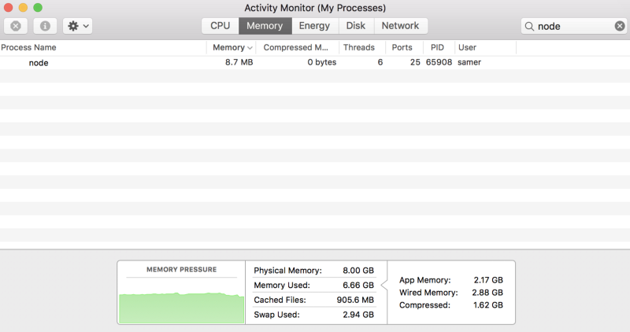

# 七天学不会nodejs——流

> 参考文章:
> - [Node.js Streams: Everything you need to know](https://medium.freecodecamp.org/node-js-streams-everything-you-need-to-know-c9141306be93)
> - [Streams in Node](https://medium.com/@yoshuawuyts/streams-in-node-ab9f13e15d5)
> - [渴望力量吗？少年！流的原理](https://juejin.im/post/5b483255f265da0f521ddf6f)
> - [nodejs官方文档](http://nodejs.cn/api/stream.html#stream_stream)


图片来源 [视觉中国](https://www.vcg.com/creative/813084182)  

## “流”的概念
> 流（stream）是一种在 Node.js 中处理流式数据的抽象接口  ——官方文档  

流是数据的集合，你可以将它理解成数据链表或者字符串的形式，区别在于流中的数据并不能立即可用，这里又可以将其理解成水流。你无需将所有的数据一次性全部放入内存，相反，你可以使用流这一特有的性质，完成对大量数据的操作以及逐段处理的操作

在node异步处理数据的基础上，流将要传输的数据处理成小份数据(chunk)连续传输，这样通过更少的内存消耗，从而带来更多的性能提升

## “流”的类型
Node.js中有四种基本类型的流：
- `Writable` -- 可读流 可以读取数据的源的抽象。 eg. `fs.createReadStream()`
- `Readable` -- 可写流 可以写入数据目标的抽象。 eg. `fs.createWriteStream()`
- `Duplex` -- 双向流(双工流) 既是可读的，又是可写的。 eg. `not.Socket`
- `Transform` -- 变换流(可变流) 读写过程中可以修改或者转化数据的`双向流`。 eg. `zlib.createDeflate()`

所有的流都是 `EventEmitter` 的实例，他们发出可以被读和写的事件，在这个基础上，我们能够很方便的利用 `pipe` 方法对这些流进行操作
```js
readableSrc.pipe(writableDest)
```
上面这个简单的例子中，我们利用 `readable stream` 的输出作为 `writable stream` 的输入。
那么再来想，如果我们的输入输出都是 `Duplex` 那就可以一直 `pipe` 下去，实现如 Linux 命令般连续的操作。
如果你有用过 `gulp` 进行前端资源的压缩整合，对于此一定会印象深刻

## Node.js中内建的流

下表中全部数据Node.js中原生的对象，这些对象也是可以读写的流，一部分是双工流与可变流
注意：一个 HTTP 相应在客户端是可读流，但在服务端就是可写流。 `stdio` 流(`stdin`, `stdout`, `stdout`)在子进程中有着与父进程中相反的类型，也正是这样，父子通信才变的简单

| Readable Stream | Writable Stream |
| ------ | ------ |
| HTTP response (客户端) | HTTP request (客户端) |
| HTTP request (服务端) | HTTP response (服务端) |
| fs read streams | fs write streams |
| zlib streams | zlib streams |
| crypto streams | crypto streams |
| TCP sockets | TCP sockets |
| child process stdout, stderr | child process stdin |
| process.stdin | process.stdout, process.stderr |

## 通过一个简单例子凸显流在实际云用中的重要性
1. 利用可写流创建一个大文件，向 `big.file` 写入100万行数据，文件大约 400M (这里没有什么问题)
```js
const fs = require('fs');
const file = fs.createWriteStream('./big.file');

for(let i=0; i<= 1e6; i++) {
    file.write('Lorem ipsum dolor sit amet, consectetur adipisicing elit, sed do eiusmod tempor incididunt ut labore et dolore magna aliqua. Ut enim ad minim veniam, quis nostrud exercitation ullamco laboris nisi ut aliquip ex ea commodo consequat. Duis aute irure dolor in reprehenderit in voluptate velit esse cillum dolore eu fugiat nulla pariatur. Excepteur sint occaecat cupidatat non proident, sunt in culpa qui officia deserunt mollit anim id est laborum.\n');
}

file.end();
```

2. 执行上面的脚本，生成文件。执行下面的脚本。启动用来发送 `big.file` 的 node 服务。使用 `curl` 连接启动的 node 服务
```js
const fs = require('fs');
const server = require('http').createServer();

server.on('request', (req, res) => {
    fs.readFile('./big.file', (err, data) => {
        if (err) throw err;

        res.end(data);
    });
});

server.listen(8000);
```
当启动 node 服务并未连接时候，内存的占用为 8.7M，属于正常情况(下图)


当使用 `curl localhost:8000` 连接服务器，可以清晰看到一次性读取会消耗多少内存(下图)


3. Node.js 的 fs 模块提供了对于任何文件可以使用的 `createReadStram` 方法，我们可以利用此方法将读取到的流 `pipe` 到响应，减轻服务器负担。代码以及效果如下
```js
const fs = require('fs');
const server = require('http').createServer();

server.on('request', (req, res) => {
  const src = fs.createReadStream('./big.file');
  src.pipe(res);
});

server.listen(8000);
```


可以看到，node服务对于内存的压力得到了力度极大的释放，并且在输出速度上依然很快。这里即很直观的体现了此文一开始提到的，node利用流通过极少内存的占用，高效完成了对大文件的操作。最后用一个形象的例子比喻一下上面的操作：
货运工人有一车的货物需要搬运，他可以选择将车上的货物全部卸下，然后一起搬到目的地；他还可以选择通过使用履带，将货物一件一件运输到目的地。试想一下，这两种方式操作的效率。

## FS操作中流的使用
上面整体介绍了`流的概念`、`流的类型`、`使用流的优点`，接下来通过具体的代码，整理一些在fs模块中流的使用方式。
- 可读流 ReadableStream
- 可写流 WritableStream

### 可读流 ReadableStream

#### 创建可读流 `fs.createReadStream(path, )`
```js
const fs = require('fs);

const rs = fs.createReadStream('text.txt'); // options

/**
    fs.createReadStream(path, {
    flags: 'r', // 读文件，文件不存在报错，默认'r'
    encoding: 'utf-8', // 以什么编码格式读取文件(可以被Buffer接收的任何格式)，默认读取buffer
    autoClose: true, // 读取后是否自动关闭文件，默认true
    highWarterMark: 100, // 每次读取的字节数，默认64k(65536)
    start: 0, // 开始读取的位置，默认0
    end: 200 // 读取文件的终点索引，默认 Infinity
    })
 **/
```
> 注意：  
> `end` 如果设置为100,则需要读取的字节数为101，即0~100，包括100  
> 因为默认 `flags` 为 `'r'`,如果 `path` 指向的文件不存在，即会报错

#### 监听事件 `open`、`data`、`end`、`close`、`error` 事件
上文提到：所有的流都是 `EventEmitrer` 的实例
```js
const fs = require('fs);

const rs = fs.createReadStream('text.txt');

rs.on('open', () => {
    console.log('open');
});

rs.on('data', (datas) => {
    console.log('file is read', datas);
})

rs.on('close', () => {
    console.log('file is closed');
});

rs.on('error', (err) => {
    console.log(err);
});

/**
   依次输出
   open
   文件的内容(buffer)
   file is closed
 **/
```
> 注意：  
> `data` 事件可能被多次触发，如果将 `highWarterMark` 设置为3，读取写有`0123456789`的`text.txt`文件时，会触发四次，依次输出012、345、678、9对应的buffer

#### 调用方法 `pause`、`resume`，暂停、恢复
```js
/**
 * text.txt文件内容 0123456789
 */
const fs = require('fs');

const rs = fs.createReadStream('text.txt', {
    encoding: 'utf-8',
    highWaterMark: 3,
});

rs.on('data', (datas) => {
    console.log(datas);
    rs.pause();
    console.log('stream is paused now');
});

rs.on('end', () => {
    console.log('stream is end');
    clearInterval(interval); // 清除定时器，否则会一直打印stream is resumed now
});

const interval = setInterval(() => {
    rs.resume();
    console.log('stream is resumed now');
}, 1000);

/**
   输出：
   012
   stream is paused now
   stream is resumed now
   345
   stream is paused now
   stream is resumed now
   678
   stream is paused now
   stream is resumed now
   9
   stream is paused now
   stream is end
 **/
```
> 注意：
> 没什么注意的

### 可写流 WritableStream

#### 创建可写流 `fs.createWriteStream(path, )`
```js
const fs = require('fs');
fs.createWriteStream(path, options);

const ws = fs.createWriteStream('2.txt', {
    flags: 'w', // 默认'w'写入文件，不存在则创建
    encoding: 'utf-8'
    fd: null, // 文件描述符
    mode: 0o666, // 文件操作权限，同438
    autoClose: true,
    start: 0 // 开始写入位置
});
```
> 注意：  
> options 参数与 `createReadStream` 不同

#### 

###


-------


## Tips
- 虽然一个 HTTP 响应在客户端是一个可读流，但在服务器端它却是一个可写流。这是因为在 HTTP 的情况中，我们基本上是从一个对象（http.IncomingMessage）读取数据，向另一个对象（http.ServerResponse）写入数据。
- 还需要注意的是 stdio 流（stdin，stdout，stderr）在子进程中有着与父进程中相反的类型。这使得在子进程中从父进程的 stdio 流中读取或写入数据变得非常简单。
- 可读流上最终要的两个事件
    - `data` 事件
    - `end` 事件
- 可写流上最重要的两个事件
    - `drain` 事件
    - `finish` 事件