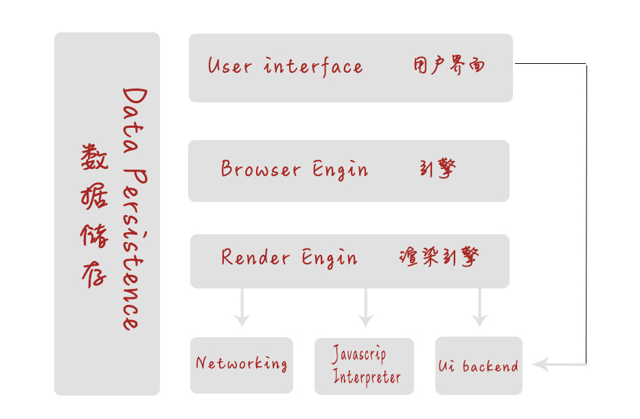
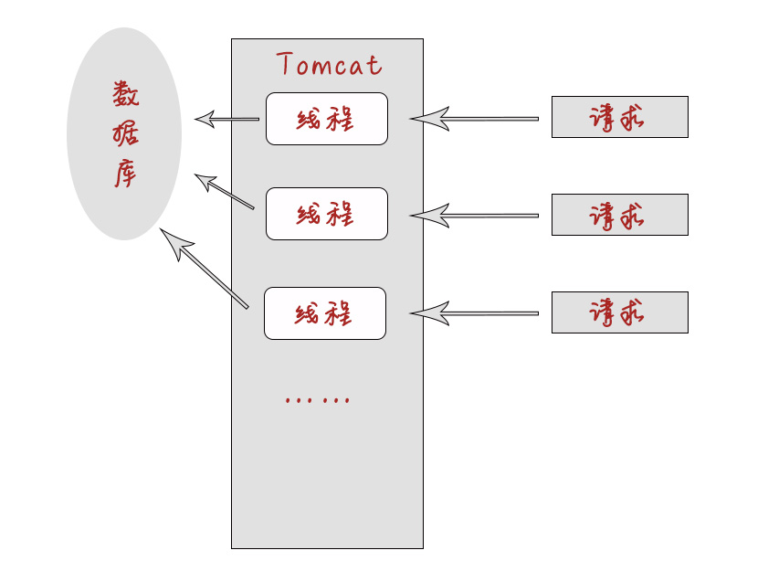
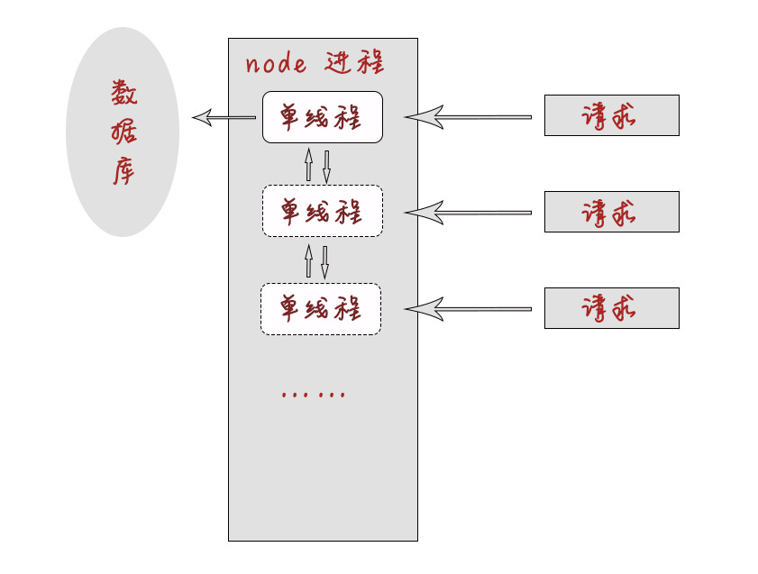

# 学习就是要打牢基础之 node

## 什么是node
> node不是一门语言，是基于ChromeV8引擎的 **runtime（运行时）**，是 JS 在后端运行的一个环境，且不包括 JS 全集  

![node与js]./im(g/collection-of-node.jpg)

## 为什么使用node

我们经常听到node有如下优点：
- 天生优秀的高并发处理能力
- 非阻塞（异步、callback）
- 强大的 I/O 处理能力
- 模块化（CommonJs）

理解以下关键词：
1. 什么是同步异步
2. 是什么是异步 I/O
3. 什么是阻塞与非阻塞
4. 什么是事件循环与事件驱动
5. 什么是单线程
6. 什么是进程
7. 什么是子进程（扩展：启动子进程、进程通信）

## 初步了解进程

### 浏览器原理


- 浏览器是多进程的
- 进程拥有多个线程，如上图的 UI 线程
- UI 线程与 JS 线程是互斥的
- 浏览器渲染引擎又叫浏览器内核
- Chrome插件对应一个进程（第三方插件进程）
- GPU提高渲染效率，对应GPU进程

### I/O 密集型(对比JAVA)
图一：Tomcat多线程处理web任务


图二：Node单线程处理web任务


可见 node 在web应用中的 I/O （读写操作、输入输出、请求响应） 操作是很高效的。
Node 适合处理 I/O 密集型应用，而非 CPU 密集型应用

## node 开发三大件
- npm 包管理器(大家都懂)
- nvm node版本管理工具(大家也懂)
- nrm node npm源管理工具(大家也懂)

## 全局变量
- console
- process 常用于设置环境变量
- Buffer
- ……

process
```JS
console.log(process);
```

mac设置NODE_ENV
```bash
> $ export NODE_ENV=dev
```

## node的模块化
> node 的每一个文件都是一个模块，是 node 模块化的一个划分规则

- 问题
    - 在 node 文件中 `console.log(this)` 输出结果是什么？
    - 如果不用 `var` 声明变量 `a`，那么这个 `a` 会在哪里？
- 几个需要注意的地方
    - 异步微任务，`process.nextTick()` 中的 `this`
    - `setTimeout()` 与 `setImmediate()` 中的 `this`
    - talk is cheap, show me the code

箭头函数 this 指向的是函数的父级作用域，所以在回调函数中尽量使用 `() => {}`
```JS
setTimeout(() => {
    console.log(this);
    // console.log(arguments);
}, 0)
```

从上面的 `arguments` 例子中，我们看到了 箭头函数的父作用域，也就是当前 node 模块是有 `arguments` 存在的。这是不是可以证明 node 模块本质就是一个闭包？(其实没有那么高深莫测哦~)
```JS
// try this
console.log(a);
```

所以 node 模块化，一个模块内被传入
- __dirname
- __filename
- exports
- module
- require()

模块化有什么好处
- 高内聚
- 低耦合
- 易维护

node依赖的是 commonjs 规范
- 一个文件就是一个模块
- 使用 `require` 来引用，`require()` 可以写入代码逻辑，不用置顶
- 使用 `exports`/`module.exports`

扩展：
- 浏览器中的模块化
    - CMD：seajs 就近依赖
    - AMD：requirejs 前置依赖
- ES6标准模块

## 通过一些例子深入了解 node 的模块化
第一个例子：node 模块没有输出
```JS
// 文件a
const a = 1;
const b = function() { console.log('this is file a'); }

// 文件b
const fileA = require('./a.js');
console.log(fileA);
```


其实 node 模块其中真正的实现是酱紫：
```js
(function(exports, require, module, __filename, __dirname) {

    module.exports = exports = this = {};

    /*------ our code -------*/

    return module.exports;
})()
```

既然了解了 node 模块输入输出到底是怎么回事，name看下面这个例子
```js
// 文件a
exports = 123;

// 文件b
const fileA = require('./a');
console.log(fileA);
```

再看下面的一个问题：
> 上面我们了解到了 node 模块化的本质，在我们以往的编码经验中，我们也知道，require()过来的代码对立即执行  
```js
// a文件
console.log('这里是a文件');
const func = () => {
    console.log('这是a文件的函数');
}
module.exports = func;

// b文件
const fileA = require('./a');
fileA();
```

那么再看下面的这个问题：
```js
// a文件
console.log('这里是a文件');
const func = () => {
    console.log('这是a文件的函数');
}
module.exports = func;

// b文件
require('./a');
require('./a');
require('./a');
```


