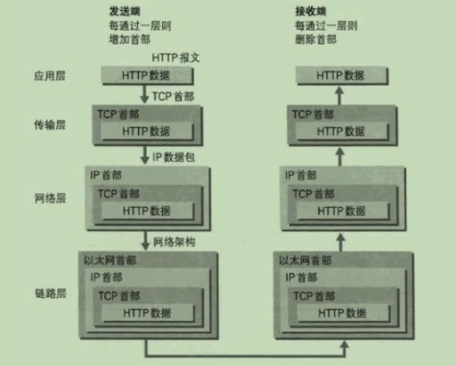
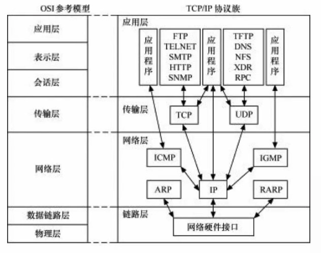

# TCP/IP 协议族&实战

## 目标
- 了解OSI七层模型的意义
- 了解二层及ARP协议
- 了解网络层及IP协议
- 人情TCP连接的本质
- 与HTTP结合学习
- 掌握基本的网络命令
- 如何实践

## 一些问题
- 学习TCP/IP协议族有何意义
- 常见的前端优化手段理论基础是什么
- 在事件中可以应用在哪里
- docker的网络应该如何配置，难的是背后的一些网络知识
- https与http的区别，https的意义，JS与https
- http2与http1.1的区别，实践（分析）
- HTTP协议，fetch规范

## 软件开发者关注的网络模型
> OSI网络模型分为 7 层，由下至上分别为：  
1. 物理层          网线交换机路由器
2. 数据链路层       网卡交换机，光信号，电信号转化为机器比特的一层，信号以帧的形式存在，处理与物理设备交互的具体细节
3. 网络层          IP、将上层帧形式存在的信号封装成片，封包，因为数据再网络中时分组传输的
4. 传输层          TCP、UDP，处理端口到端口的
5. 会话层
6. 表示层          例如SSL协议
7. 应用层          HTTP，处理网络数据与应用程序的交互细节。比如HTTP协议将二进制的网络数据变成很多头body等

我们关注的是四个层
- 数据链路层 比如两个mac地址的传输对应关系
- 网络层
- 传输层
- 应用层

## TCP/IP协议族
- 左边封包
- 右边拆包
- 底部中间是网络传输
- http是不关注ip与端口的，只是关注对网络数据的各种头以及body的修饰，传输层tcp关注端口，网络层关注ip

