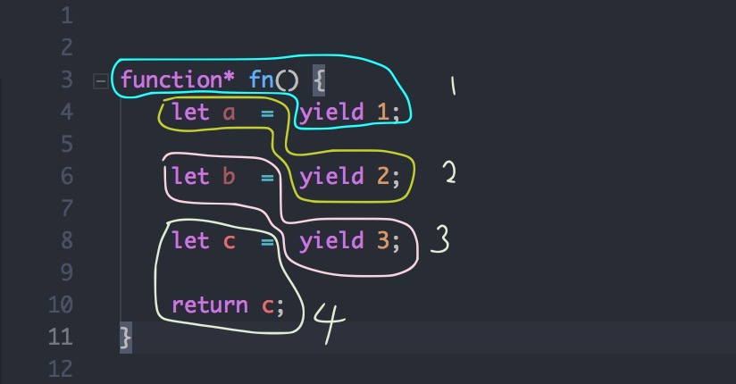

# generator & co

## generator
生成器，生成器调用返回 迭代器

开始之前的一个例子，如何将类数组变成数组
```js
const obj = { 0: 1, 1: 2, 2: 3, length: 3 };
// 上面的 obj 是一个类数组，具有length，且每一项具有 key value，key是字符串的number，但是该数据无法迭代，因为其没有迭代器

function makeIterable() {
    return [...arguments].join('');
}
```

如果调用以上的代码，无法得到正确的据俄国，因为，`...`操作默认作用在可迭代对象上，也就是具有 `Symbol.iterator`接口的对象，上面的类数组`obj`不具有此接口，所以是不可迭代的，如果想要让其可迭代可以给其添加`iterator`接口，可以参考 Iterator，这里不再赘述,参考下面的代码

```js
迭代函数
let obj = { 0: 1, 1: 2, 2: 3, length: 3 ,[Symbol.iterator]:function () {
    let currentIndex = 0;
    let that = this;
    return {
        next(){
            return { value: that[currentIndex++],done:currentIndex-1 === that.length}
        }
    }
}}
```

再来看一下迭代器`generator`的基本写法

```js
function* fn() {
    yield 1;
    yield 2;
    return 3;   // 这里的return是用来“兜底”的，结束迭代，如果这里还是yield，那么第三次调用返回的done还是false，第四次调用才会返回true
}

let it = fn();

let r = it.next();
console.log(r);        // { vlaue: 1, done: false }

let r = it.next();
console.log(r);        // { vlaue: 2, done: false }

let r = it.next();
console.log(r);        // { vlaue: 3, done: true }
```

上面的代码 `next` 需要手动掉，那是否可以让其自动掉，先掉一次，如果`done`是`false`就继续调用，容易想到使用`do while` 语句可以实现

```js
function* fn() {
    yield 1;
    yield 2;
    return 3;   // 这里的return是用来“兜底”的，结束迭代，如果这里还是yield，那么第三次调用返回的done还是false，第四次调用才会返回true
}

let it = fn();
let done = false;
do {
    let r = it.next();
    done = r.done;
    console.log(r.value);
} while (!done);
```

既然generator是生成迭代器的，那么就意味着其可以取代上面给obj类数组代码的手动添加迭代器的操作

```js
let obj = { 0: 1, 1: 2, 2: 3, length: 3 ,[Symbol.iterator]:function* () {
    let len = this.length;
    let i = 0;
    while(i !== len) {
        yield this[i++];
    }
}}
```

下面看一下`generator`的执行顺序,注意 `generator` 并不是 `async/await` ，二者的执行原理有很大的区别

```js
function* fn() {
    let a = yield 1;
    console.log(a);
    let b = yield 2;
    console.log(b);
    let c = yield 3;
    console.log(c);
    return c;
}
let it = fn();
it.next();  // 没有输出
it.next();  // undefined
it.next('input');  // undefined 'input'
```

针对以上代码，我们发现:
- 第一次调用next没有执行到`console.log(a)`的代码块
- 第二次调用执行到了打印`a`，但是返回的结果却不是 `1`。
- 第三次给`next`传入`'input'`发现执行到了`console.log(b)`且打印出 `b` 的值为`'input'`

可以发现
- generator函数执行时，遇到 `yield` 关键字就暂停执行，所以前面的复制语句 `let a` 是不会执行的
- `yield` 暂停，调用 `next` 执行之后返回 `{ value: xxx, done: Boolean }` 并不会赋值给它前面的赋值语句
- `next()` 执行的时候传入的参数却会传递给 `a,b,c` 但是似乎传给了上一个赋值语句的变量

其实 `generator` 的执行顺序如下图  


可以看到
- 第一次执行 `next()` 遇到 `yield` 暂停，不会赋值给 `a`
- 第二次执行 `next()` 遇到 `yield` 暂停，会赋值给 `a`
- `yield` 的返回值不会传给前面的赋值语句，而 `next()` 执行时的参数却会传递给前面的赋值语句。

那么，如果要想上面的代码实现类似 `async/await` 的效果，即
- `a` 拿到的是第一次 `yield` 后面语句执行的返回值
- `b` 拿到的是第二次 `yield` 后面语句执行的返回值


看下面的例子：
> 三次异步操作，文件 `a` 中存放着下一次要读取的文件名 `b`，文件 `b` 中存放的是下一次要读取的文件名 `c` 如何使用上面的代码，取到最后文件 `c` 中的内容
```js
const fs = require('fs');
const { promisify } = require('util');
const readAsync = promisify(fs.readFile);

function* read() {
    const contentA = yield readAsync('a.txt', 'utf-8');
    const contentB = yield readAsync(contentA, 'utf-8');
    const contentC = yield readAsync(contentB, 'utf-8'); 
    return contentC;
}

let it = read();
let { value } = it.next(); // value 是yield返回值的value，是一个pending状态的promise
value.then((content) => {
    let { value } = it.next(content);   // 传入第一次读取的内容，得到第二个pending的promise
    value.then((content) => {
        let { value } = it.next(content);   // 传入第二次读取的内容，得到第三个pending的promise
        value.then((content) => {
            console.log(content);
        });
    })
});
```

结合上面的代码就能够理解 `co` 的实现原理了
```js
function co(it) {
    return new Promise((resolve, reject) => {
        let { value, done } = it.next(data);
        if (done) {
            resolve(value);
        } else {
            value.then((data) => {
                next(data);
            }, reject);
        }
    });
}

// 结合上面的代码可以：
co(read()).then((res) => {
    console.log(res);
});
```
