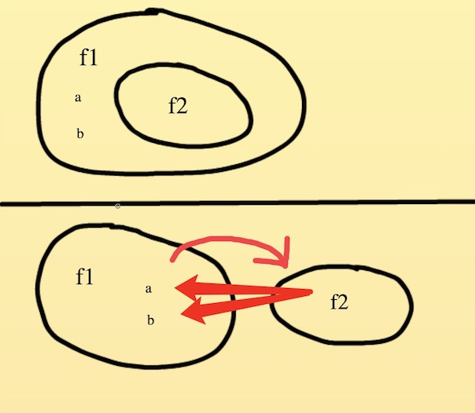
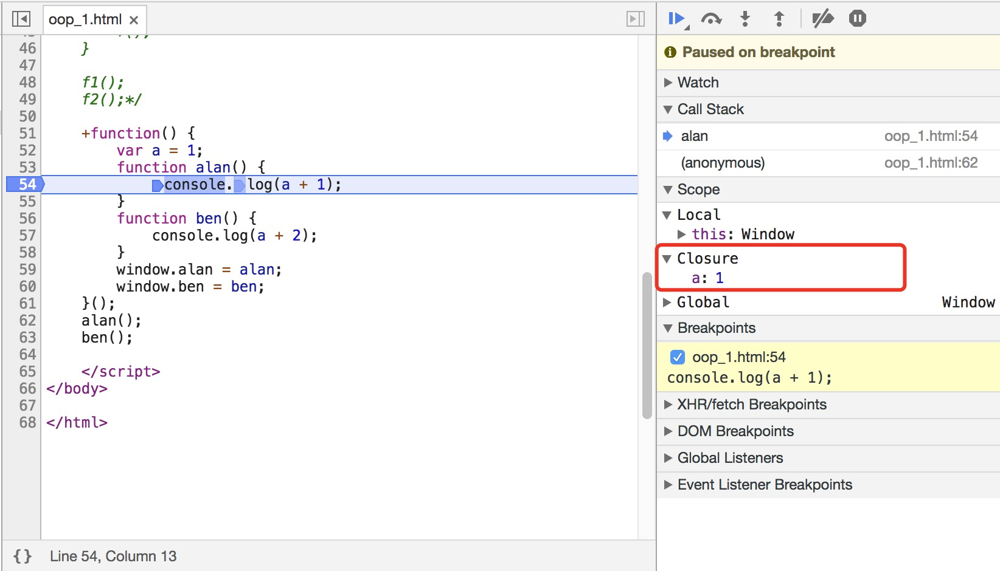

# 闭包

## 目录
- 全局暴露函数
- 什么是闭包
- 闭了什么
- 如何查看闭包
- 了解闭包的好处
- 使用闭包的注意点

上一篇介绍函数的作用域时，引出并介绍了闭包的概念，接下来继续讨论闭包

## 全局暴露函数
> 场景：有时候两个函数的定义都依赖同一个变量，又不想分别重复定义，这个时候可以利用闭包的特性
```js
(function() {
    var a = 1;
    var b = 2;

    function alan() {
        console.log(a + 1);
    }

    function ben() {
        console.log(b + 2);
    }
    window.alan = alan;
    window.ben = ben;
})();
alan();
ben();

```

## 什么是闭包
维基百科解释：
> 又称词法闭包（Lexical Closure）或函数闭包（function closures），是引用了自由变量的函数。这个被引用的自由变量将和这个函数一同存在，即使已经离开了创造它的环境也不例外。所以，有另一种说法认为闭包是由函数和与其相关的引用环境组合而成的实体。  

乡村版解释1：
> 一个函数可以拿到外部环境的变量

乡村版解释2：
> 一个函数拿到了不属于自己的东西

## 闭了什么
通过一个小栗子以及图文进一步了解
```js
function f1() {
    var a = 1;
    var b = 2;
    function f2() {
        console.log(a + b);
    }
    f2();
}
f1();
结果：打印出 3
----------------------------------
function f1() {
    var a = 1;
    var b = 2;
    return function f2() {
        console.log(a + b);
    }
}
var result = f1();
result();
结果：打印出 3
----------------------------------
上面的两段代码不同之处在于：
上方 f2 函数创建以及执行始终在 f1 之中
下方 f2 函数创建在 f1 之中，执行在 f1 之外，但是在 f1 之外执行的时候，仍然保留了a和b的值
就像上一章讲作用域提到的，f2创建的词法环境，决定了自己能够使用哪些变量，关键词【创建时】
```


## 如何查看闭包
打开浏览器调试工具，Closure 既是闭包
但是不同浏览器会有不同


## 了解闭包的好处

## 使用闭包的注意点