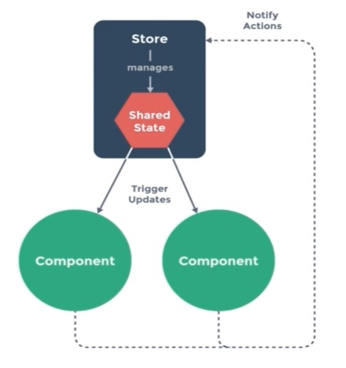

- vue 全局注册组件的方法 Vue.component
- 组件避免data引用赋值，使用function ruturn 的方法
- 全局api
- 实例方法以及属性，例如 $on
- 内置组件 <component></component>
- 更改使用 赋值 语句更改data中的某一项，视图不会直接更改，使用Vue.set()方法可以
- 引入子组件(ES6 语法下)
```javascript
// 假设当前是在主组件文件下
import childComp1 from './components/childComp1';
import childComp2 from './components/childComp2';
export default = {
    // 这是一种 ES6 的简写方式
    components: { childComp1, childComp2 }

    // 实际上相当于
    components: { 
        childComp1: = 'childComp1', 
        childComp2: = 'childComp2'
    }
// 最后通过标签的形式在主组件中引入子组件
}
```
- v-bind绑定的属性可以同步更新，简写 `:title="..."`
- class的绑定方法,下面例子将仅显示类名 `red-font`
``` html
<!-- 单一绑定 -->
<div :class="className1"><div>
<!-- 多个变量绑定 -->
<div :class="[className1, className2]"><div>
<!-- 混用 -->
<div :class="[className1, {'error': hasErr}]"><div>
<!-- 行内样式 -->
<div :class="linkCss"><div>
<script>
    // 省略部分代码
------------------------------------------
    // 仅显示类名 `red-font1`、`red-font2`、`hasErr`
    data() {
        return {
            className1: {
                red-font1: true,
                blue-font1: false
            }
            className2: {
                red-font2: true,
                blue-font2: false
            },
            hasErr: true,
            linkCss: {
                'color': 'red',
                'font-size': '20px'
            }
        }
    }
------------------------------------------
    // 显示 `red-font1`、`blue-font1`、`red-font2`、`blue-font2`、
    data() {
        return {
            className1: ['red-font1', 'blue-font1']，
            className1: ['red-font2', 'blue-font2']，
            hasErr: false,
            linkCss: {
                'color': 'red',
                'font-size': '20px'
            }
        }
    }
<script>
```
- 条件判断 v-if、v-else 与 v-show
- 事件操作 v-on,简写为 @,**事件修改器**见下例子
```html
<!-- 阻止冒泡 -->
<button @click.stop="toggle"></button>
<!-- keydown的修改器,这里可以使用key code，例如13-->
<button@keydown.enter="doSomething"></button>
```
- 自定义事件，可以用于父子组件之间的数据传递
- 表单的数据绑定是通过 v-model 绑定的
``` html
<!-- 勾选后会自动填充 data 中的myBox数组 -->
<input v-model="mtBox" type="radio" value="apple"/>
<input v-model="mtBox" type="radio" value="banana"/>
<input v-model="mtBox" type="radio" value"panaple"/>

<script>
    // 省略部分代码
    data() {
        return: {
            // !!! 注意这里必须实现定义声明 myBox，不然会报错，此处声明了myBox的初始值是一个空数组
            myBox: [];
        }
    }
</script>
```
- v-model控制select
``` html
<select v-model="selection">
    <option value="1"></option>
    <option value="2"></option>
    <option value="3"></option>
</select>
<span>{{ selection }}</span>

<script>
    // 省略部分代码
    data() {
        return: {
            // !!! 同样，此处声明了selection的初始值是null
            selection: null;
        }
    }
</script>
---------------------------------------------
// 当然可以通过动态循环的形式初始化每一个option
<select v-model="selection">
    // 注意这里必须使用 :value 也就是bind的形式, 否则解析出的value仅仅是一堆字符串
    <option v-for="item in selectOption" :value="item.value">
        {{item.name}}        
    </option>
</select>
<span>{{ selection }}</span>

<script>
    // 省略部分代码
    data() {
        return: {
            selectOption: [
                {name: 'apple', value: 0},
                {name: 'banana', value: 1},
                {name: 'pinaple', value: 2}
            ],
            selection: null;
        }
    }
</script>
```
- v-model 支持三种修改器
> v-model.lazy
> 
> 
```html
输入完成之后 失焦或者enter，双向绑定的值才会动态更新
<div id="app">
	// 执行失焦或者enter操作完成视图渲染
    <input type="text" v-model.lazy="lazy">
    <span>{{lazy}}</span><br>
    // 输入的值为数值
    <input type="text" v-model.number="number">
    <span>{{typeof number}}</span><br>
    // 去除字符首尾的空格
    <input type="text" v-model.trim="trim">
    <span>{{trim}}</span><br>
    // 当然三者可以连用，like：
    <input type="text" v-model.trim.lazy.number="trim">
    <span>{{trim}}</span><br>
</div>
    

<script>
    const app = new Vue({
        el: '#app',
        data: {
            lazy: null,
            number: null,
            trim: null
        }
    });
</script>
```

- 计算属性与事件调用
> 计算属性与事件调用往往能达到相同的效果，但是他们本质的区别在于：  
>1、计算属性是会被缓存的，他只会根据我们被调用的属性来进行更新  
>2、而方法调用则在每次调用的时候都重新获取一次值  
>3、比如二者return的都是 Date.now();前者显示的是页面渲染初期的时间，而后者则是显示时间被调用时候的时间
```html
<div id="app">
    <p>其实这里绑定的value，但是通过计算属性，使得myValueWithoutNum也能动态更新</p>
    <input type="text" v-model="myValue"/>
    <span>
        {{myValueComputed}}<br>
        {{myValueWithoutNum}}<br>
        {{myValueMethod()}}
    </span>
    <hr> 
</div>

<script>
    var app = new Vue({
        el: '#app',
        data: {
            myValue: ''
        },
        computed: {
            myValueWithoutNum() {
                return this.myValue.replace(/\d/g, '');
            },
            myValueComputed() {
                return this.myValue + 'end'
            }
        },
        methods: {
            myValueMethod() {
                return this.myValue.replace(/\d/g, '');
            }
        }
        
    });
</script>
```

- 属性监听 watch
> 注意：函数参数为 function(新， 旧) {}  
> 应用场景：比如用户想要实现，每次修改（增删改。。。）v-for 出来的list都执行一个方法 tellUser();这时候就可以将数据list watch起来，调用 tellUser 方法即可
```html
<div id="app">
    <p>结合lazy使用会有更好的效果哦~~~</p>
    <input type="text" v-model="myValue">
</div>
<script>
    var app = new Vue({
        el: '#app',
        data: {
            myValue: ''
        },
        watch: {
            myValue: function(val, oldVal) {
                console.log(val, oldVal);
            }
        }
    });
</script>
```
- 组件相关tips
>* 项目只会初始化一个Vue实例
>* 每个组件通过export的形式输出，import的形式引入
>* 引入新的组件之后需要注册组件，通过component: {}
>* 组件引入的命名可以是ComA，调用的时候最好写成<com-a>,vue会自动解析大小写以及‘-’，Vue2.0 写成<ComA>也不会报错
>* 
- 通过:is动态引入组件，注意：组件必须全部提前声明
```html
<div>
    <p is="someValue"></p>
    <p :is="someValue"></p>
</div>

import ComA from './components/com-a'
import ComB from './components/com-b'
components: {
    ComA,
    ComB
},
data: {
    // 这里可以更改 someValue: 'com-b' 的值达到动态引入组件
    someValue: 'com-a'
}
```
- 父子组件之间的通信 视频第四章8:30
>* 父组件向子组件
```html
// 父组件中：注意属性大小写不敏感，请使用中线‘-’做分割，这里的值 5 始终传递的是字符串，不论有没有“”
<com-a number-to-do="5"></com-a>

// 子组件中声明属性,通过props声明的属性没有必要再在data中声明，同样可以直接拿来用
props: ['numberToDo'],

// props接受两种类型的值，出了数组还有对象，对象可以规定属性值的类型,不满足会报错
props: {
    numberToDo: [Number', String],
}

```
>* 子组件向父组件,通过触发事件，可以使用自定义事件
```html
// 父组件，向特定句名的子组件传递
<com-a>
    <p slot="header">This is header~</p>
</com-a>

// 子组件，特定句名的子组件拥有默认值
<p name="header">No header~</p>
```
>* 插槽<slot></slot>传递模板,插槽可以设定默认值
- 动态组件（上面有提过）视屏4，21:00,注意<keep-alive></keep-alive>实现缓存
- vue过渡功能以及动画  

```html
// 这是一个简单渐隐tab，transition组件必须要配合特定的条件才可以实现，比如v-show、v-if、动态组件
// transition 默认先进后出，这里可以设置mode属性，让第一个元素渐隐后第二个元素再渐入
<transition name="fade" mode="out-in">
    <p v-show="show">xxx</p>
</transition>
<button v-on:click="show = !show">click</button>
-------------------------------------------------------
// 注意: Vue多元素过渡的时候，相同标签名的元素之间过渡不会执行，需要有key属性，Vue才可以识别
```
-----
- router-link
```html
// 因为用了 : 所以是‘apple’
<router-link :to="'apple'"></router-link>
// 或者直接写成定值，不使用bind
<router-link to="apple"></router-link>
// 或者使用
<router-link :to="{path: '/apple'}"></router-link>
```
- router-link的tag属性
```html
// 原本页面默认显示的是a标签，通过tag可以设置为li，如下
<router-link :to="'apple'" tag="li"></router-link>
```
- 路由与路由传递参数，声明式
```javascript
// 路由配置中
{path: 'apple/:color', component: Apple}

// 对应的组件中取值
console.log(this.$route.params);
// 当然$route.params被注入到子组件之后，模板中也是可以访问到的
<p>{{ $route.params.color }}</p>
----------------------------------------------------------
// 直接在router-link中设置params进行传递
<router-link :to="{path: '/apple', params:{color: 'yellow'}}"></router-link>
```
- 页面处于当前router-link指向的路由时候，当前的router-link会被加上一个默认的router-link-active类名
- 编程式的导航
```javascript
router.push('apple')
// 或者
router.push({path: 'apple'})
// 再或者使用router的name，假设现在设置的是applePage
router.push({name: 'applePage'})
// 应用场景
router.beforeEach() 是路由每次切换的时候，在其中传入回调函数，检查用户的登录状态，未登录，则调用router.push('home')
```
- 子路由
```javascript
// 访问的路由是xxx/apple/red
// 注意，路由切换之后，RedApple显示的位置必须是在 apple 组件中的<router-link>,而不是跟组件的。
routes: [
    {
        path: '/apple',
        component: Apple,
        children: [
            path: 'red',
            component: RedApple
        ]
    },
    {
        path: '/banana',
        component: Banana
    }
]
```
- 命名视图
``` html
<router-view name="viewA"></router-view>

// router.js 文件中：制定不同的组件到不同的router-view
<script>
    const router = new Router({
        mode: 'history',
        routes: [
            {
                path: '/apple',
                name: 'applePage',
                component: {
                    viewA: Apple,
                    viewB: RedApple
                }
            }
        ]
    });
</script>
```
- 路由的重定向
``` html
<router-view name="viewA"></router-view>
<router-view name="viewB"></router-view>

// router.js 文件中：设置重定向路径
<script>
    const router = new Router({
        mode: 'history',
        routes: [
            {
                path: './',
                redirect: '/apple'
            },
            {
                path: '/apple',
                name: 'applePage',
                component: {
                    viewA: Apple,
                    viewB: RedApple
                }
            }
        ]
    });
</script>
```
- <router-view>路由配合<transition>和<keep-alive>
```html
// 配合这两个标签，既能实现过渡效果，又能实现组件的缓存，避免重复向服务器发送请求
<transition>
    <keep-alive>
        <router-view></router-view>
    </keep-alive>
</transition>
```
-----
- 状态管理插件 vuex
> 在实际的开发过程中，有些信息或者状态是需要所有组件共享的，比如登录状态或者购物车商品条目，简单的做法就是通过事件的调用，但是这样每当状态更新后，都必须调用这个事件通知所有的组件，消耗太大

