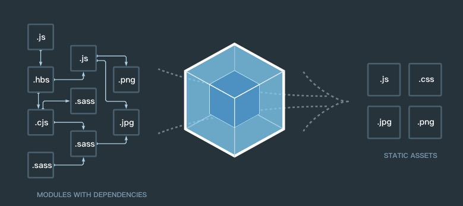

# webpcak4基本配置分享

> 一句话总结webpack功能：模块化打包工具

## webpack能够做什么
- 代码转换：TypeScript 编译成 JavaScript、SCSS 编译成 CSS 等
- 文件优化：压缩 JavaScript、CSS、HTML 代码，压缩合并图片等
- 代码分割：提取多个页面的公共代码、提取首屏不需要执行部分的代码让其异步加载
- 模块合并：在采用模块化的项目里会有很多个模块和文件，需要构建功能把模块分类合并成一个文件
- 自动刷新：监听本地源代码的变化，自动重新构建、刷新浏览器
- 代码校验：在代码被提交到仓库前需要校验代码是否符合规范，以及单元测试是否通过
- 自动发布：更新完代码后，自动构建出线上发布代码并传输给发布系统

最后两点其实是工程化下面的范畴，说白了也就是使用代码自动化流程

## 简单谈谈工程化
- 基石：nodejs，node的出现让使用javascript语言操作文件与计算机内存变得可能，也是因为node，大量的前端自动化工具出现
- 流：gulp、grunt
- 模块：webpack、parcel、rollup、fis
- 前端测试：单元测试、e2e测试，一系列的测试库。。。
- 发布工具：jenkins、travis

## 使用webpcak

### webpack核心概念
- Entry：入口，Webpack 执行构建的第一步将从 Entry 开始，可抽象成输入。
- Module：模块，在 Webpack 里一切皆模块，一个模块对应着一个文件。Webpack 会从配置的 Entry 开始递归找出所有依赖的模块。
- Chunk：代码块，一个 Chunk 由多个模块组合而成，用于代码合并与分割。
- Loader：模块转换器，用于把模块原内容按照需求转换成新内容。
- Plugin：扩展插件，在 Webpack 构建流程中的特定时机注入扩展逻辑来改变构建结果或做你想要的事情。
- Output：输出结果，在 Webpack 经过一系列处理并得出最终想要的代码后输出结果。

> Webpack 启动后会从Entry里配置的Module开始递归解析 Entry 依赖的所有 Module。 每找到一个 Module， 就会根据配置的Loader去找出对应的转换规则，对 Module 进行转换后，再解析出当前 Module 依赖的 Module。 这些模块会以 Entry 为单位进行分组，一个 Entry 和其所有依赖的 Module 被分到一个组也就是一个 Chunk。最后 Webpack 会把所有 Chunk 转换成文件输出。 在整个流程中 Webpack 会在恰当的时机执行 Plugin 里定义的逻辑。

### 配置webpack

#### 安装webpack
```
npm install webpack webpack-cli -D
```

#### 最简单配置
```
const path=require('path');
module.exports={
    entry: './src/index.js',
    output: {
        path: path.resolve(__dirname,'dist'),
        filename:'bundle.js'
    },
    module: {},
    plugins: [],
}
```

#### 配置本地开发服务器 dev-server
```
devServer: {
    contentBase :path.resolve(__dirname,'dist'),
    host: 'localhost',
    compress: true,
    port: 8080
}
```

### 自动产出html
```
npm i html-webpack-plugin -D
```

```
plugins: [
    new HtmlWebpackPlugin({
    template: './src/index.html',
    filename: 'index.html'
    hash: true,
    minify: {
        removeAttributeQuotes: true
    }
})]
```

#### 加载css文件
使用不同的`loader`，Webpack可以要把不同的文件都转成 *_JS_* 文件,比如`CSS`、`ES6/7`、`JSX`等

```
npm install style-loader css-loader -D
```
三种方式配 loader：`loader`、 `use`、 `loader+use`

```
rules: [
    {
        test: /\.css$/,
        loader: ['style-loader', 'css-loader']
    }
]

rules: [
    {
        test: /\.css$/,
        use: ['style-loader', 'css-loader']
    }
]

rules: [
    {
        test: /\.css/,
        use: [
            {
                loader: 'style-loader',
                options: {
                    insertAt:'top'
                }
            },
            'css-loader'
        ]
    }
]
```

#### 分离css
```
npm install --save-dev mini-css-extract-plugin
```

```
use: [
        {
            loader: MiniCssExtractPlugin.loader,
            options: {
                publicPath: '../'
            }
        },
        "css-loader"
    ]
```

#### 支持图片
```
npm i file-loader url-loader -D
```

- file-loader  解析项目中url资源的引入
- url-loader   内置 file-loader 可以压缩图片成base64

```
{
    test:/\.(jpg|png|bmp|gif|svg|ttf|woff|woff2|eot)/,
    use:[
        {
            loader:'url-loader',
            options:{limit:4096},
            options: {
                outputPath: 'img'
            }
        }
    ]
}
```

注意 outputPath 与 publicPath

#### 在HTML中使用图片
```
npm i html-withimg-loader -D
```

```
{
    test: /\.html$/,
    use: 'html-withimg-loader'
}
```

#### 压缩CSS和JS
```
npm i uglifyjs-webpack-plugin -D
npm i optimize-css-assets-webpack-plugin -D
```

```
optimization: {
    minimizer: [
        new UglifyJsPlugin(),
        new OptimizeCssAssetsPlugin()
    ]
},
```

#### 使用 sass 和 less
```
npm i less less-loader -D
npm i node-sass sass-loader -D
```

```
{
    test: /\.less$/,
    include: path.resolve(__dirname,'src'),
    exclude: /node_modules/,
    use: [{
        loader: miniCssExtractPlugin.loader,
    },'css-loader','less-loader']
},
```

```
{
    test: /\.scss$/,
    include: path.resolve(__dirname,'src'),
    exclude: /node_modules/,
    use: [{
        loader: miniCssExtractPlugin.loader,
    },'css-loader','sass-loader']
},
```

#### 使用postcss
自动添加前缀
- Trident内核：主要代表为IE浏览器, 前缀为-ms
- Gecko内核：主要代表为Firefox, 前缀为-moz
- Presto内核：主要代表为Opera, 前缀为-o
- Webkit内核：产要代表为Chrome和Safari, 前缀为-webkit
```
npm i postcss-loader autoprefixer -D
```

```
const autoprefixer = require('autoprefixer');
module.exports = {
    plugins: [
        require('autoprefixer')({
            // Options see: https://www.npmjs.com/package/autoprefixer#options
            browsers: [
                'last 3 version',
                'ie >= 8',
            ],
            //  should Autoprefixer [remove outdated] prefixes. Default is true.
            remove: false,
        }),
        require('postcss-opacity'),
        require('postcss-pseudoelements'),
        require('postcss-color-rgba-fallback')({
            // Set to true to enable the option and to get fallback for ie8.
            // see https://www.npmjs.com/package/postcss-color-rgba-fallback
            oldie: true,
        }),
    ],
}
```
了解cssnext

#### 编译JS
```
npm install babel-loader @babel/core @babel/preset-env
```

```
{
    test: /\.js$/,
    exclude: /(node_modules|bower_components)/,
    use: {
        loader: 'babel-loader',
        options: {
            presets: ['@babel/preset-env']
        }
    }
}
```

```
{
    "presets": [
        [
            "@babel/preset-env",
            {
                "useBuiltIns": "entry"
            }
        ]
    ]
}
```

> 就在两天前，旧版本的写法,针对 babel-loader 7.x
```
{
    test: /\.jsx?$/,
    use: {
        loader: 'babel-loader',
        options: {
            presets: ["env","stage-0","react"],
            plugins:["transform-decorators-legacy"]
        }
    },
    include: path.join(__dirname,'src'),
    exclude:/node_modules/
}
```

babel其他扩展优化：
- cacheDirectory：默认值为 false。当有设置时，指定的目录将用来缓存 loader 的执行结果。
- babel runtime
    - babel 在每个文件都插入了辅助代码，使代码体积过大
    - babel 对一些公共方法使用了非常小的辅助代码，比如 _extend
    - 默认情况下会被添加到每一个需要它的文件中。你可以引入 babel runtime 作为一个独立模块，来避免重复引入

```
npm install babel-plugin-transform-runtime --save-dev
npm install babel-runtime --save
```

#### 配置eslint

```
npm install eslint --save-dev
npm install eslint-loader --save-dev

{
    test: /\.js$/,
    exclude: /node_modules/,
    loader: "eslint-loader",
    options: {
        fix: true
    }
}
```

#### 拷贝静态文件

#### 打包前先清空输出目录

```
new CleanWebpackPlugin([path.resolve(__dirname,'dist')])
```

#### 打包第三方类库
1.直接引入
```
import _ from 'lodash';
alert(_.join(['a','b','c'],'@'));
```

2.插件引入, `_` 函数会自动添加到当前模块的上下文，无需显示声明
```
new webpack.ProvidePlugin({
    _:'lodash'
})
```

3.expose-loader, 不需要任何其他的插件配合，只要将下面的代码添加到所有的loader之前

```

```

4.externals, 如果我们想引用一个库，但是又不想让webpack打包，并且又不影响我们在程序中以CMD、AMD或者window/global全局等方式进行使用，那就可以通过配置externals
```
const jQuery = require("jquery");
import jQuery from 'jquery';
```

```

```


### 其他，常用loader列表
> webpack 可以使用 loader 来预处理文件。这允许你打包除 JavaScript 之外的任何静态资源。你可以使用 Node.js 来很简单地编写自己的 loader。 awesome-loaders

#### 文件
- raw-loader 加载文件原始内容（utf-8）
- val-loader 将代码作为模块执行，并将 exports 转为 JS 代码
- url-loader 像 file loader 一样工作，但如果文件小于限制，可以返回 data URL
- file-loader 将文件发送到输出文件夹，并返回（相对）URL

#### JSON
- json-loader 加载 JSON 文件（默认包含）
- json5-loader 加载和转译 JSON 5 文件
- cson-loader 加载和转译 CSON 文件

#### 转换编译(Transpiling)
- script-loader 在全局上下文中执行一次 JavaScript 文件（如在 script 标签），不需要解析
- babel-loader 加载 ES2015+ 代码，然后使用 Babel 转译为 ES5
- buble-loader 使用 Bublé 加载 ES2015+ 代码，并且将代码转译为 ES5
- traceur-loader 加载 ES2015+ 代码，然后使用 Traceur 转译为 ES5
- ts-loader 或 awesome-typescript-loader 像 JavaScript 一样加载 TypeScript 2.0+
- coffee-loader 像 JavaScript 一样加载 CoffeeScript

#### 模板(Templating)
- html-loader 导出 HTML 为字符串，需要引用静态资源
- pug-loader 加载 Pug 模板并返回一个函数
- jade-loader 加载 Jade 模板并返回一个函数
- markdown-loader 将 Markdown 转译为 HTML
- react-markdown-loader 使用 markdown-parse parser(解析器) 将 Markdown 编译为 React 组件
- posthtml-loader 使用 PostHTML 加载并转换 HTML 文件
- handlebars-loader 将 Handlebars 转移为 HTML
- markup-inline-loader 将内联的 SVG/MathML 文件转换为 HTML。在应用于图标字体，或将 CSS 动画应用于 SVG 时非常有用

#### 样式
- style-loader 将模块的导出作为样式添加到 DOM 中
- css-loader 解析 CSS 文件后，使用 import 加载，并且返回 CSS 代码
- less-loader 加载和转译 LESS 文件
- sass-loader 加载和转译 SASS/SCSS 文件
- postcss-loader 使用 PostCSS 加载和转译 CSS 文件,并结合插件处理各种业务场景下的 CSS 问题
- stylus-loader 加载和转译 Stylus 文件

#### 清理和测试(Linting && Testing)
- mocha-loader 使用 mocha 测试（浏览器/NodeJS）
- eslint-loader PreLoader，使用 ESLint 清理代码
- jshint-loader PreLoader，使用 JSHint 清理代码
- jscs-loader PreLoader，使用 JSCS 检查代码样式
- coverjs-loader PreLoader，使用 CoverJS 确定测试覆盖率

#### 框架(Frameworks)
- vue-loader 加载和转译 Vue 组件
- polymer-loader 使用选择预处理器(preprocessor)处理，并且 require() 类似一等模块(first-class)的 Web 组件
- angular2-template-loader 加载和转译 Angular 组件
